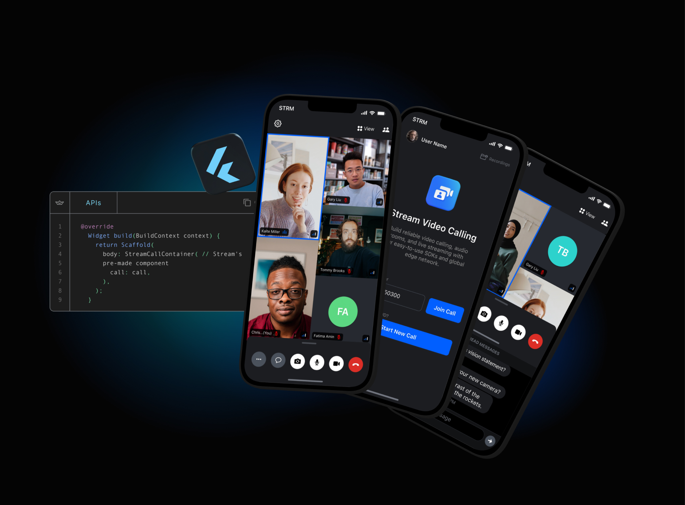

# Official Flutter packages for the [Stream Video SDK](https://getstream.io/video/sdk/flutter/)

  
  
  
  
  
  

## Quick Links

- [Register](https://getstream.io/video/) to get an API key for Stream Video
- [Sample apps](https://github.com/GetStream/flutter-video-samples)

This repository contains code for our [Dart](https://dart.dev/) and [Flutter](https://flutter.dev/) video clients.

We use [Melos](https://melos.invertase.dev) to manage this repository.

## Understanding the structure of the repository

* The `packages` folder contains the packages and plugins that the SDK consists of.
* The `examples` folder holds the samples created using the Flutter Video SDK.
* The `docusaurus` folder contains the documentation and guides.
* The `dogfooding` folder contains a complete example app that implements all of the features of the SDK.

## Process to get started with this repository

1. Clone the base repository.
4. Run `melos postclean` to clean the project.
5. Run `melos bootstrap` to fetch dependencies for all projects.
6. Run `melos generate:all` to generate the required files.
7. You can now run any app in the project or start making changes to the SDK.

If you see any unexpected behaviour in the repository, feel free to [file an issue](https://github.com/GetStream/stream-video-flutter/issues/new) in the repository.

## Roadmap

Video roadmap and changelog is available [here](https://github.com/GetStream/protocol/discussions/127)

The Flutter specific roadmap is available [here](development.md). 

