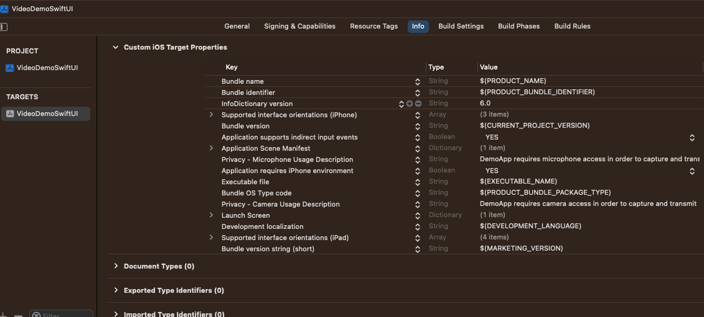

### Creating a Project

To get started with the `StreamVideo` Flutter SDK, open your terminal or IDE and create a new project:

```shell
flutter create video_demo
```

Next, in your project directory (`video_demo`), install the Stream Video SDK using the following:

```shell
flutter pub add stream_video_flutter
```

This will automatically install the latest version of the Stream SDK from pub to the dependencies section of your `pubspec.yaml`.

### Permissions

Making video calls requires the usage of the device's camera and microphone. Therefore, before you can make and answer calls, you need to request permission to use them within your application.

The following permissions must be granted for both Android and iOS:

- Internet Connectivity
- Camera
- Microphone (+ control audio settings to adjust audio level & switch between speaker & earpiece)
- Bluetooth (wireless headset)

#### iOS



For iOS, you need to add the following keys and values to your `Info.plist` file at a minimum:

`Privacy - Camera Usage Description` - "<Your_app_name> requires camera access to capture and transmit video"

`Privacy - Microphone Usage Description` - "<Your_app_name> requires microphone access to capture and transmit audio"

#### Android

For Android, similar permissions are needed in `<project root>/android/app/src/main/AndroidManifest.xml`

```xml
<uses-feature android:name="android.hardware.camera" />
<uses-feature android:name="android.hardware.camera.autofocus" />
<uses-permission android:name="android.permission.CAMERA" />
<uses-permission android:name="android.permission.RECORD_AUDIO" />
<uses-permission android:name="android.permission.ACCESS_NETWORK_STATE" />
<uses-permission android:name="android.permission.CHANGE_NETWORK_STATE" />
<uses-permission android:name="android.permission.MODIFY_AUDIO_SETTINGS" />

```

With Android specifically, you will also need to add additional permission if you would like to use Bluetooth devices:

```xml
<uses-permission android:name="android.permission.BLUETOOTH" android:maxSdkVersion="30" />
<uses-permission android:name="android.permission.BLUETOOTH_ADMIN" android:maxSdkVersion="30" />
```

## Platform Version

Stream's Flutter Video SDK is supported on Android and iOS devices running the following versions and higher:

- Android: SDK version 21 and above
- iOS: iOS 11 and above

:::note
For iOS, when setting the minimum version, please also be sure to update the `deployment_target` in your project's Podfile.
:::
