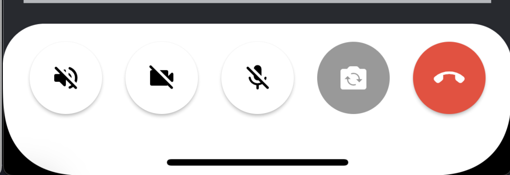
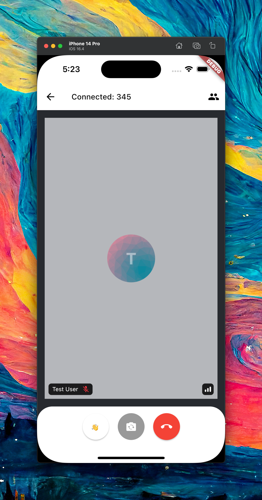
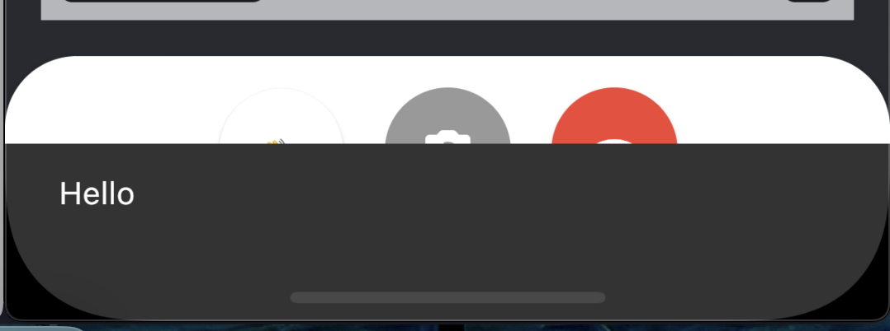

The Flutter Video for Stream Video is a highly customizable SDK that facilitates adding calling (audio and video) support to your apps.

The SDK consists of three parts:

* Low-level client ([stream_video](https://pub.dev/packages/stream_video)): Responsible for establishing calls, built on top of WebRTC.
* UI SDK ([stream_video_flutter](https://pub.dev/packages/stream_video_flutter)): Flutter widgets for different types of call flows.
* VoIP SDK ([stream_video_push_notification](https://pub.dev/packages/stream_video_push_notification)): Adds native calling interface support for Android and iOS (CallKit).

In this guide, we will build a video calling app that shows how you can integrate the SDK in few simple steps.

If you haven't already, we recommend starting with the [introduction](https://getstream.io/video/docs/flutter/) and [installation](https://getstream.io/video/docs/flutter/installation/) steps first, as this guide will build on the material covered in those sections.

### Client Setup

Before we can create a new video client, we must first import the Stream Video package into our application.

```dart
import 'package:stream_video_flutter/stream_video_flutter.dart';
```

Next, in our application’s `main` function, let’s add the following:

```dart
Future<void> main() async {
  // Ensure Flutter is able to communicate with Plugins
  WidgetsFlutterBinding.ensureInitialized();

  // Initialize Stream video and set the API key along with the user for our app.
  final client = StreamVideo(
    'REPLACE_WITH_API_KEY',
    user: User.regular(userId: 'REPLACE_WITH_USER_ID', name: 'Test User'),
    userToken: 'REPLACE_WITH_TOKEN',
  );

  // Set up our call object
  final call = client.makeCall(callType: StreamCallType(), id: 'REPLACE_WITH_CALL_ID');
  // Connect to the call we created
  await call.join();

  runApp(
    DemoAppHome(
      call: call,
    ),
  );
}
```

In the code above, we are performing a few key steps:

1. Initializing our SDK with the API key for our application.
2. Defining the user we would like to connect as to participate in a call.
3. Creating an object for our call, giving it the call type and unique ID.
4. Connecting to the call we defined.

### Call UI

Stream ships with many pre-made components to make building your call UI as simple as possible. All of our UI components are designed to be flexible and customizable, meaning as a developer, you can control exactly how much (or how little) of Stream’s stock components you would like to have in your app.

With our `Call` object defined, let’s create the UI for our application. Since this is meant to be a quick-start guide, we can simply pass down the `call` defined earlier to our UI widget, but in a production scenario, you can define these calls in a repository or any other state layer of your choice.

```dart
class DemoAppHome extends StatelessWidget {
  const DemoAppHome({Key? key, required this.call}) : super(key: key);

  final Call call;

  @override
  Widget build(BuildContext context) {
    return Scaffold(
      body: StreamCallContainer( // Stream's pre-made component
        call: call,
      ),
    );
  }
}
```

Using our default `StreamCallContainer` along with the `call` created earlier, we can compile our sample application and examine the result.


In just a few lines of code, we can have a fully functional call screen in our application. Out of the box, `StreamCallContainer` ships with an AppBar, Participant view, and Call Controls. These components can be themed to fit your app's style or be overridden entirely using a builder to allow for custom UIs and interactions.

### Taking it one step further

For fun, let's take a look at customizing the UI of our application to include a custom icon in the control area.



Looking at our current UI code, we can make use of Flutter’s composition and builder pattern to override the default UI with our own.

```dart
@override
  Widget build(BuildContext context) {
    return Scaffold(
      body: StreamCallContainer(
        call: call,
        callContentBuilder: (context, call, callState) {
        },
      ),
    );
  }
```

`StreamCallContainer` ships with many different builders that can be implemented to override the default UI and behavior. Since we are interested in changing the content/UI of our call, we can override the `callContentBuilder` as a starting point.

:::note
    Please take a minute to explore and look at the other parameters you can customize. There are many options for changing colors, layouts, behaviour, etc.
:::

Next, we can use another Stream UI component, `StreamCallContent` to access the control area and add our custom button.

```dart
@override
  Widget build(BuildContext context) {
    return Scaffold(
      body: StreamCallContainer(
        call: call,
        callContentBuilder: (context, call, callState) {
          return StreamCallContent(
            call: call,
            callState: callState,
            callControlsBuilder: (context, call, callState) {
						    // Override the controls builder in StreamCallContent
            },
          );
        },
      ),
    );
  }
```

Finally, we can return the controls and options we would like to display to the user

```dart
return StreamCallContent(
    call: call,
    callState: callState,
    callControlsBuilder: (context, call, callState) {
      final localParticipant = callState.localParticipant!;
      return StreamCallControls(
        options: [
          CallControlOption(
            icon: const Text('👋'),
            onPressed: () => ScaffoldMessenger.of(context).showSnackBar(
              const SnackBar(
                content: Text('Hello'),
              ),
            ),
          ),
          FlipCameraOption(
            call: call,
            localParticipant: localParticipant,
          ),
          LeaveCallOption(call: call, onLeaveCallTap: call.leave),
        ],
      );
    },
  );
```



When tapped:
