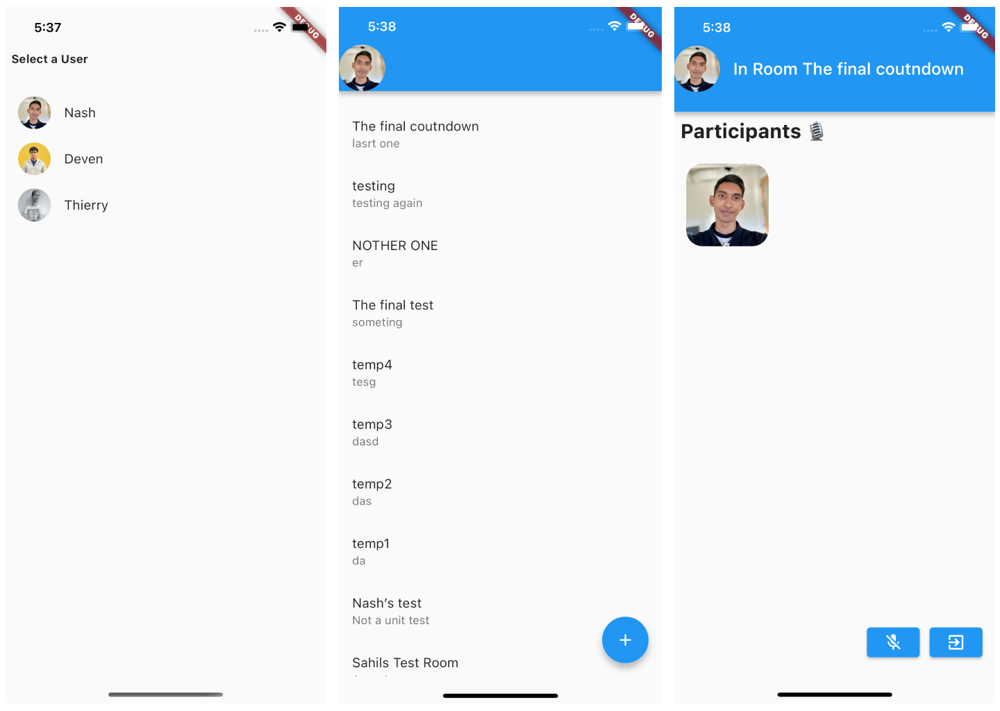

In this tutorial, we will learn how to build an audio room experience similar to Twitter Spaces or Clubhouse using Stream Video.

Before we dive into the Audio Rooms APIs, there are a few fundamental things to understand:

- Backstage: When an `audio_room` call is created, it exists in backstage mode by default. This means that the call creator and co-hosts can chat with each other privately before the call is set live and others can join.
- All calls run on Stream's global edge network for improved latency and quality. When a user connects to a call, they connect to a server closest to their location. Stream further optimizes this in the background.
- There are no limits to the number of users you can have in a room.
- By default, listeners are muted and require speaking permission before they can send audio. The call host can grant this permission.
- Stream sends audio tracks multiple times for improved quality and reliability.

### Create a new project

Let's begin by creating a new Flutter project and adding the `stream_video_flutter` package to the project.

```bash
flutter create audio_example --empty

cd audio_example

flutter pub add stream_video_flutter
```

Next, you can create a project on Stream’s dashboard to obtain an API key for your project.

For detailed instructions on how to create a project on the Stream Dashboard, please see our [blog post](https://getstream.io/blog/registering-for-stream-chat/).

### Setting up the UI



The UI we will be building for this example will be minimal, but the principles and structures can be used to create more elaborate designs.

To get started, we prepared a sample project which can be cloned from this [repository](https://github.com/GetStream/flutter-audio-room-example.git). The project contains three screens, a login, home feed and room screen which we will add functionality to.

```bash
git clone https://github.com/GetStream/flutter-audio-room-example.git

git checkout static-ui
```

### Setting up the client

Let’s start by importing the video package to `main.dart` and initializing our client using the API key from our `env.dart` file:

```dart
import 'package:stream_video_flutter/stream_video_flutter.dart';
```

```dart
void main() {
  WidgetsFlutterBinding.ensureInitialized();
  // Initialize Stream video and set the API key for our app.
  StreamVideo.init(Env.apiKey, logPriority: Priority.debug);
  runApp(const MainApp());
}

class MainApp extends StatelessWidget {
  const MainApp({super.key});

  @override
  Widget build(BuildContext context) {
    return const MaterialApp(
      home: LoginScreen(),
    );
  }
}
```

For this example, we are going to use three hard-coded users. Looking at the code in our `login_screen.dart`, we are creating a simple list that provides users with the options to select a user and continue to the main screen of our application.

```dart
Widget build(BuildContext context) {
    const v20 = SizedBox(height: 20);
    return Scaffold(
      body: SafeArea(
        child: Column(
          crossAxisAlignment: CrossAxisAlignment.start,
          children: [
            const Padding(
              padding: EdgeInsets.all(8.0),
              child: Text(
                'Select a User',
                style: TextStyle(fontWeight: FontWeight.bold),
              ),
            ),
            v20,
            for (final user in kUsers)
              ListTile(
                title: Text(user.name),
                leading: CircleAvatar(
                  backgroundImage: NetworkImage(user.imageURL),
                ),
                onTap: () async {
				// Connect to StreamVideo using the selected user at login.
                  await StreamVideo.instance.connectUser(
                    user.toUserInfo(),
                    user.token,
                  );
                  Navigator.of(context).pushReplacement(
                    HomeScreen.routeTo(user),
                  );
                },
              ),
          ],
        ),
      ),
    );
  }
```

### Creating and displaying a list of rooms

After a user is selected, they are taken to the `HomeScreen` where a list of active rooms is displayed. By clicking on a room, the user can join and listen to the ongoing conversation. At the moment, we do not display anything in our app but we will implement this soon.

Let’s start by implementing the room creation methods before we add the ability to query rooms.

In our example project, let's open `lib/screens/home_screen.dart` and start our implementation by adding the ability to create a room in `createRoom` and `_onDialogPressed`.

To begin let’s look at the `createRoom` method. We can call `makeCall` on the `StreamVideo` class and supply the call type as `audio_room`. Unlike the `default` room type, which allows full video and audio transmission as well as the ability for users to un-mute themselves and speak by default, the `audio_room` type applies a few restrictions to calls so that the host and speakers have more granular controls.

```dart
final room = video.makeCall(
  type: "audio_room",
  id: const Uuid().v4(),
);

await room.getOrCreate();
await room.update(
  custom: {
    'name': title,
    'description': description,
    'flutterAudioRoomCall': true,
  },
);

return room;
```

Next, we can call our function using the data supplied by the user when they complete the “create room” dialog:

```dart
Future<void> _onDialogPressed((String, String) roomInfo) async {
  final call = await createRoom(
    roomInfo.$1,
    roomInfo.$2,
  );

  // By default, audio rooms are created in a backstage mode.
  final result = await call.goLive();

  final room = result.getDataOrNull()!;
  log('Joining Call: ${call.callCid}');
  Navigator.of(context).push(
    AudioRoomScreen.routeTo(call, room, user),
  );
}
```

The code above calls the `createRoom` function we just defined passing it the room title and description as parameters. Unlike default meeting rooms, audio rooms are started in a “backstage” mode by default.

This allows the room creator or host to invite other speakers before the room is made public and before participants are allowed to join. When the room is ready, `goLive` can be invoked to publish the room and make it possible for other participants to join.

The remaining code in this section pushed the newly created room to a new page which we will cover in a later section.

### Querying rooms

With our room created, we can query the list of active audio rooms in our application by using Stream’s `queryCalls` method.

```dart
Future<List<QueriedCall>> queryCalls() async {
  final result = await video.queryCalls(
    filterConditions: {
      "custom.flutterAudioRoomCall": true, // Filtering based on a custom property!
    },
  );

  if (result.isSuccess) {
    return result.getDataOrNull()?.calls ?? [];
  } else {
    final error = result.getErrorOrNull();
    log('[queryCalls] failed with error $error');
    throw Exception('No rooms found');
  }
}
```

As we talked in about in a previous tutorial, there are many ways in which developers can query calls on the Stream platform. The method we are using in this example is querying calls based on a the custom property `flutterAudioRoomCall: true`. This narrows the number of call to those created from our sample application ensure they contain the right structure and permissions. Of course, you can feel free to experiment with this and by setting custom properties or filtering.

With filtering in place, if you hot restart the application, there should be one room in our app created earlier. To join the room, we can implement the final method in our home screen `joinRoom`:

```dart
Future<void> joinRoom(QueriedCall room) async {
  final cid = room.call.cid;
  final call = video.makeCall(type: cid.type, id: cid.id);

  await call.join();
  log('Joining Call: $cid');
  Navigator.of(context).push(
    AudioRoomScreen.routeTo(call, room.call, user),
  );
}
```

### Room screen

Opening `lib/screens/audio_room_screen.dart`, we can tour the implementation of displaying participants.

Every call object has an associated `CallState` which can be observed as a `stream` for changes. These changes can then be used to update the UI of our application. The most common way to interact with the call state in our UI layer would be to observe the `state` using a `StreamBuilder` and handle the new data as it comes in.

To see this in use, let’s take a look at the `_buildParticipants` method:

```dart
Widget _buildParticipants() {
    return StreamBuilder<CallState>(
      initialData: callState,
      stream: call.state.asStream(), // Listen for changes on the state stream.
      builder: (context, snapshot) {
        if (snapshot.hasError) {
          return const SliverToBoxAdapter(
            child: Center(
              child: Text('We are not able to find rooms at this time'),
            ),
          );
        }
        if (snapshot.hasData && !snapshot.hasError) {
          callState = snapshot.data!; // Extract new CallState
          listeners = _sortParticipants(callState.callParticipants);

		// Display listeners as a Grid
          return SliverGrid(
            delegate: SliverChildBuilderDelegate(
                  (BuildContext context, int index) {
                return Align(
                  widthFactor: 0.8,
                  child: StreamCallParticipant(
                    call: call,
                    backgroundColor: Colors.transparent,
                    participant: listeners[index],
                    showParticipantLabel: false,
                    showConnectionQualityIndicator: false,
                    userAvatarTheme: const StreamUserAvatarThemeData(
                      constraints: BoxConstraints.expand(
                        height: 100,
                        width: 100,
                      ),
                    ),
                  ),
                );
              },
              childCount: listeners.length,
            ),
            gridDelegate: const SliverGridDelegateWithFixedCrossAxisCount(
              crossAxisCount: 3,
            ),
          );
        }
        return const SliverToBoxAdapter(
          child: Center(
            child: CircularProgressIndicator(),
          ),
        );
      },
    );
  }
```

In the above method, we are listening for changes to the call such as if a participant begins speaking, joins or leaves the call, etc., and updating the `SliverGrid`. Even though we are using the default `StreamCallParticipant` to perform the heavy lifting of rendering our call participant and speaking indicators, developer are free to use their own custom UI here as the `CallParticipantState` object exposes many properties to the user.

### Controlling the microphone

An audio room example would not be complete without the ability to control whether the user is speaking or not. For this, the `setMicrophoneEnabled` method can be invoked on the `Call` object. If the user has speaking permissions, their audio tracks will be published and they will be allowed to speak during the call.

```dart
void _onMicrophonePressed() {
  if (enabled.value) {
    call.setMicrophoneEnabled(enabled: false);
    enabled.value = false;
  } else {
    call.setMicrophoneEnabled(enabled: true);
    enabled.value = true;
  }
}
```

### Permissions and speaking requests

Should the user not have permission, it can be request using `requestPermissions` before enabling the microphone:

```dart
final result = await call.requestPermissions([CallPermission.sendAudio]);
```

For hosts or moderators, a UI can be added to show permission requests. In the case of our simple example, we can grant them automatically be adding the following code snippet to our `initState` method:

```dart
call.onPermissionRequest = (permissionRequest) {
  call.grantPermissions(
    userId: permissionRequest.user.id,
    permissions: permissionRequest.permissions.map(
      (e) => CallPermission.fromAlias(e),
    ).toList(),
  );
};
```

### Other built-in features

There are a few more exciting features that you can use to build audio rooms:

- **Query Calls**: You can query calls to easily show upcoming calls, calls that recently finished, etc
- **Call Previews**: Before you join the call you can observe the participants and show a preview
- **Reactions & Custom events**: Reactions and custom events are supported
- **Recording & Broadcasting**: You can record your calls
- **Chat**: Stream's chat SDKs are fully featured and you can integrate them into the call
- **Moderation**: Moderation capabilities are built-in to the product
- **Transcriptions**: Transcriptions aren't available yet, but they are due to launch soon

### Recap

In just a few minutes, we were able to create our first audio-room experience for our app. Please let us know if you run into any issues during the process. Our team constantly reviews feedback and applies changes to improve the overall experience.

This is just a small example of what's possible with Stream and audio. For more advanced use cases like using OPUS DTX and OPUS RED, check out some of our other examples and guides on our website and GitHub.

We hope you enjoyed this tutorial and look forward to hearing your suggestions and feedback.
