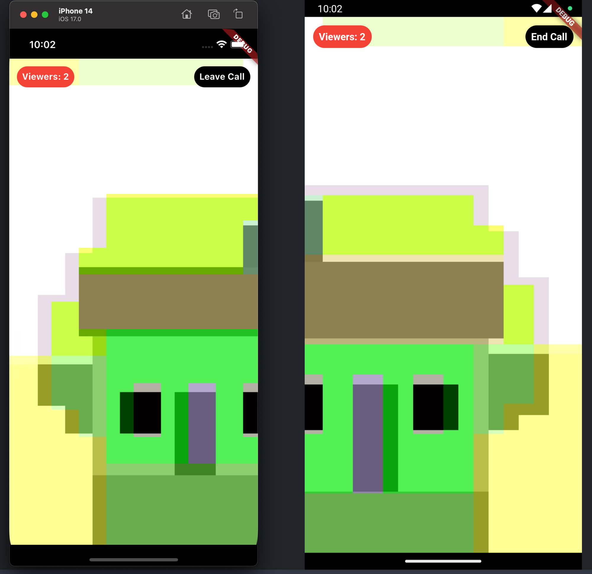
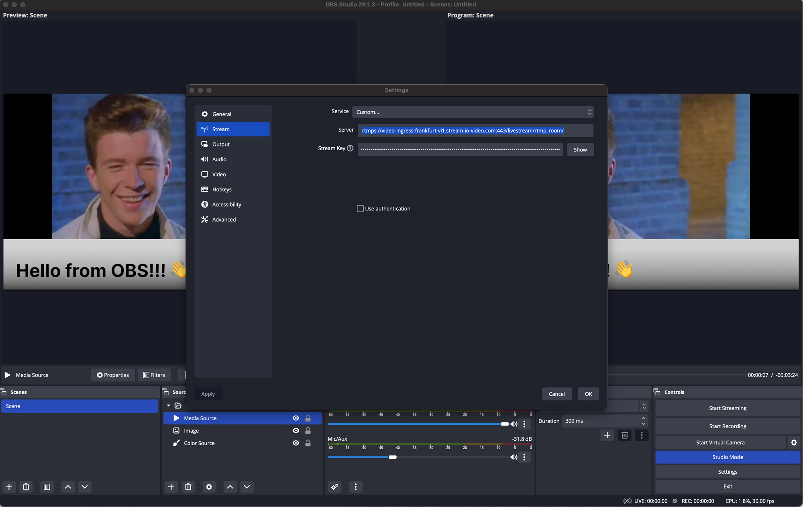

In this tutorial, we will cover the steps to quickly build a low-latency live-streaming experience in Flutter using Stream’s Video SDK. The livestream is broadcasted using Stream's edge network of servers around the world.

For this tutorial, we will cover the following topics:

- Ultra low latency streaming
- Multiple streams & co-hosts
- RTMP in and WebRTC input
- Exporting to HLS
- Reactions, custom events and chat
- Recording & Transcriptions

### Create a new project
Let’s begin by creating a new Flutter project and adding the `stream_video_flutter` package to the project.

```bash
flutter create livestream_example --empty
cd audio_example
flutter pub add stream_video_flutter
```

Next, you can create a project on Stream’s dashboard to obtain an API key for your project.

For detailed instructions on how to create a project on the Stream Dashboard, please see our [blog post](https://getstream.io/blog/registering-for-stream-chat/).

### Setting up the client
First, let’s import the package into the project we created earlier:

```dart
import 'package:stream_video_flutter/stream_video_flutter.dart';
```

Next, we can configure the Stream client and create a room for our call:

```dart
Future<void> main() async {
  // Ensure Flutter is able to communicate with Plugins
  WidgetsFlutterBinding.ensureInitialized();

  // Initialize Stream video and set the API key for our app.
  StreamVideo.init('YOUR-API-KEY', logPriority: Priority.info);

  if (Platform.isAndroid) {
    await StreamVideo.instance
        .connectUser(APIEnv.kUserJacen.$1, APIEnv.kUserJacen.$2);
  } else {
    await StreamVideo.instance
        .connectUser(APIEnv.kUserJohn.$1, APIEnv.kUserJohn.$2);
  }
  runApp(const MaterialApp(home: StreamVideoGettingStarted()));
}
```

### Setting up the UI
To keep things simple, our sample application will only consist of two screens, a landing page to allow users the ability to create a livestream and another option to allow users the ability to join an existing livestream.

**Home page:**
```dart
class StreamVideoGettingStarted extends StatefulWidget {
  const StreamVideoGettingStarted({
    super.key,
  });

  @override
  State<StreamVideoGettingStarted> createState() =>
      _StreamVideoGettingStartedState();
}

class _StreamVideoGettingStartedState extends State<StreamVideoGettingStarted> {
  Future<void> _createLivestream() async {  }

  Future<void> _joinCall() async {  }

  @override
  Widget build(BuildContext context) {
    return Scaffold(
      body: Center(
        child: Row(
          mainAxisAlignment: MainAxisAlignment.spaceEvenly,
          children: [
            ElevatedButton(
              onPressed: () => _createLivestream(),
              child: const Text('Create a Livestream'),
            ),
            ElevatedButton(
              onPressed: () => _joinCall(),
              child: const Text('Join a Livestream'),
            )
          ],
        ),
      ),
    );
  }
}

class _JoinCallDialog extends StatefulWidget {
  const _JoinCallDialog({
    super.key,
    required this.onButtonPressed,
  });

  final ValueChanged<String> onButtonPressed;

  @override
  State<_JoinCallDialog> createState() => _JoinCallDialogState();
}

class _JoinCallDialogState extends State<_JoinCallDialog> {
  late final TextEditingController _controller;

  @override
  void initState() {
    super.initState();
    _controller = TextEditingController();
  }

  @override
  void dispose() {
    super.dispose();
    _controller.dispose();
  }

  @override
  Widget build(BuildContext context) {
    return SimpleDialog(
      title: const Text('Enter your livestream ID'),
      children: [
        Padding(
          padding: const EdgeInsets.all(8.0),
          child: TextField(
            controller: _controller,
          ),
        ),
        TextButton(
          onPressed: () {
            widget.onButtonPressed(_controller.value.text);
          },
          child: const Text('Join'),
        ),
      ],
    );
  }
}
```

**Livestream Page:**
```dart
import 'package:flutter/material.dart';
import 'package:stream_video_flutter/stream_video_flutter.dart';

class LiveStreamScreen extends StatelessWidget {
  static route(Call call) => MaterialPageRoute(
        builder: (context) {
          return LiveStreamScreen(currentStream: call);
        },
      );

  const LiveStreamScreen({
    super.key,
    required this.currentStream,
  });

  final Call currentStream;

  @override
  Widget build(BuildContext context) {
    return SafeArea(
      child: StreamBuilder(
        stream: currentStream.state.valueStream,
        initialData: currentStream.state.value,
        builder: (context, snapshot) {
          final callState = snapshot.data!;
          final participant = callState.callParticipants
              .firstWhere((element) => element.isVideoEnabled);
          return Stack(
            children: [
              if (snapshot.hasData)
                StreamVideoRenderer(
                  call: currentStream,
                  videoTrackType: SfuTrackType.video,
                  participant: participant,
                ),
              if (!snapshot.hasData)
                const Center(
                  child: CircularProgressIndicator(),
                ),
              if (snapshot.hasData && callState.status.isDisconnected)
                const Center(
                  child: Text('Stream not live'),
                ),
              Positioned(
                top: 12.0,
                left: 12.0,
                child: Material(
                  shape: RoundedRectangleBorder(
                    borderRadius: BorderRadius.circular(24),
                  ),
                  color: Colors.red,
                  child: Center(
                    child: Padding(
                      padding: const EdgeInsets.all(8.0),
                      child: Text(
                        'Viewers: ${callState.callParticipants.length}',
                        style: const TextStyle(
                          fontSize: 14,
                          color: Colors.white,
                          fontWeight: FontWeight.bold,
                        ),
                      ),
                    ),
                  ),
                ),
              ),
              if (callState.localParticipant?.userId ==
                  callState.createdByUserId)
                Positioned(
                  top: 12.0,
                  right: 12.0,
                  child: Material(
                    shape: RoundedRectangleBorder(
                      borderRadius: BorderRadius.circular(24),
                    ),
                    color: Colors.black,
                    child: GestureDetector(
                      onTap: () {
                        currentStream.end();
                        Navigator.pop(context);
                      },
                      child: const Center(
                        child: Padding(
                          padding: EdgeInsets.all(8.0),
                          child: Text(
                            'End Call',
                            style: TextStyle(
                              fontSize: 14,
                              color: Colors.white,
                              fontWeight: FontWeight.bold,
                            ),
                          ),
                        ),
                      ),
                    ),
                  ),
                ),
              if (callState.localParticipant?.userId !=
                  callState.createdByUserId)
                Positioned(
                  top: 12.0,
                  right: 12.0,
                  child: Material(
                    shape: RoundedRectangleBorder(
                      borderRadius: BorderRadius.circular(24),
                    ),
                    color: Colors.black,
                    child: GestureDetector(
                      onTap: () {
                        currentStream.leave();
                        Navigator.pop(context);
                      },
                      child: const Center(
                        child: Padding(
                          padding: EdgeInsets.all(8.0),
                          child: Text(
                            'Leave Call',
                            style: TextStyle(
                              fontSize: 14,
                              color: Colors.white,
                              fontWeight: FontWeight.bold,
                            ),
                          ),
                        ),
                      ),
                    ),
                  ),
                )
            ],
          );
        },
      ),
    );
  }
}
```

### Viewing a livestream (Webrtc)
Stream offers two flavors of livestreaming, WebRTC-based livestreaming and RTMP-based livestreaming.

WebRTC based livestreaming allows users to easily start a livestream directly from their phone and benefit from ultra low latency.

To setup WebRTC based livestreaming, we can first make a call using `makeCall` and set the call type to `livestream` followed by a room ID (this can also be left blank).

Next, we can set some default behaviour for our livestream such as configuring whether the camera and microphone should be enabled by default.

Finally, we can create the call by invoking `getOrCreate` on the object we just created. By default, a `livestream` call is started in backstage mode, meaning the call hosts can join and see each other but the call will be invisible to others.

When the hosts are ready, the can make the call “live” by calling `goLive`.

```dart
Future<void> _createLivestream() async {
    // Set up our call object
    final call = StreamVideo.instance.makeCall(
      type: 'livestream',
      id: 'first_room',
    );

    // Set some default behaviour for how our devices should be configured once we join a call
    call.connectOptions = CallConnectOptions(
      camera: TrackOption.enabled(),
      microphone: TrackOption.enabled(),
    );

    final result = await call.getOrCreate(); // Call object is created
    if (result.isSuccess) {
      await call.join(); // Our local app user is able to join and recieve events from the call
      await call.goLive(); // Allow others to see and joing the call
			print('Joining call ${call.id}');
      Navigator.of(context).push(LiveStreamScreen.route(call));
    } else {
      print('Not able to create a call.');
    }
  }
```

To join the call, we can run another instance of the app on a second device and copy the call ID from the console. When the app is ready, we can click “Join a livestream” and paste in the ID we copied.

If all works as intended, we will be able to view the video feed from the first device and observe the view count increase by one.



### RTMP Livestreaming


For more advanced livestreaming configurations such as cases where multiple cameras may be required or different scenes and animations, streaming tools OBS can be used together with Stream video using RTMP (Real Time Messaging Protocol).

By default, when a call is created, it is given a dedicated RTMP URL which can be used by most common streaming platforms to inject video into the call. To configure RTMP and OBS with Stream, two things are required:

1. The RTMP URL of the call
2. A “streaming key” comprised of your application’s API Key and User Token in the format `apikey/usertoken`

With these two pieces of information, we can update the settings in OBS then select the “Start Streaming” option to view our livestream in the application!

:::note
    A user with the name and associated with the user token provided to OBS will appear in the call. It is worth creating a dedicated user object for OBS streaming.
:::

### Viewing a livestream (HLS)
The final piece of livestreaming using Stream is support for HLS or HTTP Live Streaming. HLS unlike WebRTC based streaming tends to have a 10 to 20 second delay but offers video buffering under poor network condition.

To enable HLS support, your `call` must first be placed into “broadcasting” mode using the `call.startHLS()` method.

Next, we can obtain the HLS URL by querying the `hlsPlaylistURL` from `call.state`:

```dart
final result = await call.startHLS();

if (result.isSuccess) {
  final url = call.state.value.egress.hlsPlaylistUrl;

...
}
```

With the HLS URL, your call can be broadcasted to most livestreaming platforms such as Youtube.

### Recap
In just a few minutes, we were able to create our first livestreaming experience for our app. Please let us know if you ran into any issues during the process. Our team constantly reviews feedback and applies changes to improve the overall experience.

This is just a small example of what’s possible with Stream and livestreaming.

We hope you enjoyed this tutorial and look forward to hearing your suggestions and feedback.