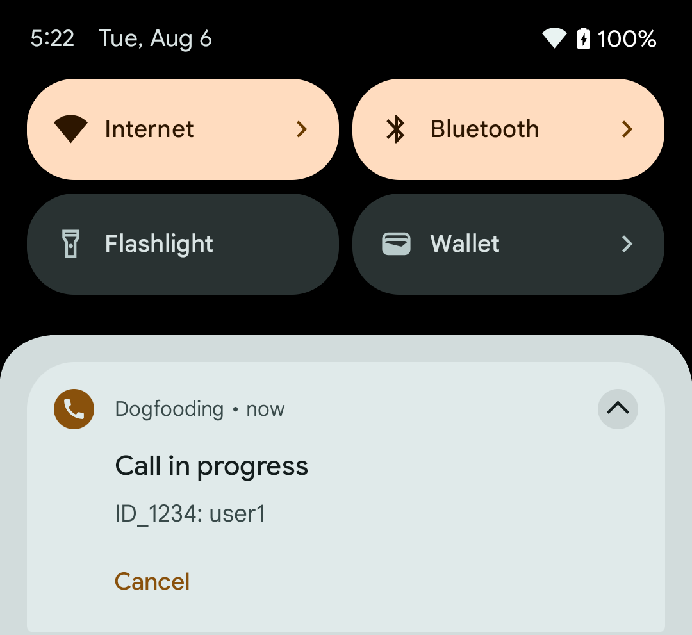
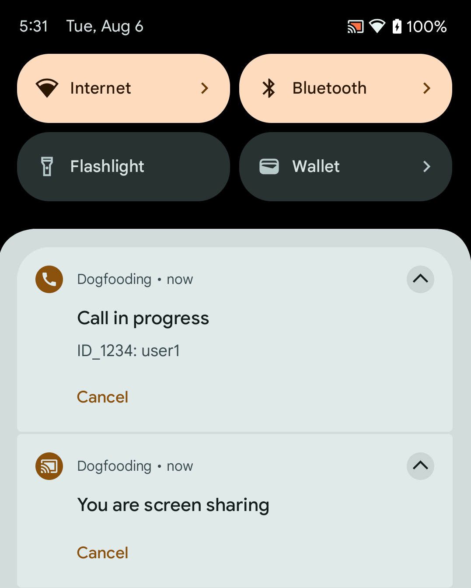

Ensuring uninterrupted video and audio calls is vital. Our SDK includes a feature to keep calls active in the background, allowing users to multitask seamlessly. On this page, you will learn how to implement and tailor this feature to your needs.

### Starting the Android foreground service

Our SDK ensures continuous calls by initiating an Android foreground service. This service keeps the process active and the call running, even if the application's UI is no longer visible. The SDK already provides the required declarations in the manifest, all you have to do is to initialize the service somewhere after starting the app.

```dart
StreamBackgroundService.init(
      StreamVideo.instance,
);
```

Our foreground service displays a notification indicating an ongoing call. This notification allows users to either exit the call or seamlessly return to it. It appears during active calls and vanishes when the user leaves the call.



### Screen sharing notification

When a user shares their screen, the SDK displays a notification to indicate that the screen is being shared. This notification allows users to either stop sharing their screen or return to the call. It appears during active screen sharing and vanishes when the user stops sharing their screen.



### Customizing the notification

You can customize the notification by providing your own notification options. The SDK provides default options for both the call and screen sharing notifications. You can override these options by passing your own `NotificationOptionsBuilder` to the `init` method.

```dart
StreamBackgroundService.init(
      StreamVideo.instance,
      callNotificationOptionsBuilder: (call) {
        return const NotificationOptions(
          content: NotificationContent(
            title: 'Call Active',
            text: 'You are in a call',
          ),
          avatar: NotificationAvatar(
            url: '{url_to_avatar}',
          ),
        );
      },
);
```

### Handling notification clicks

You can handle notification clicks by providing callbacks to the `init` method. The callback is triggered when the user taps on the notification or on a notification button. You can use this callback to bring the call back to the foreground, cancel the call or perform any other action.

By default, the SDK handles button tap by canceling the call when the user taps on the call notification and canceling screen-sharing when tapped on the screen-sharing notification. You can override this behavior by providing your own `onButtonClick` callback.

```dart
 StreamBackgroundService.init(
      StreamVideo.instance,
      onButtonClick: (call, type, serviceType) async {
        switch (serviceType) {
          case ServiceType.call:
            // Add or replace with custom behavior
            await call.leave();
            await call.reject(reason: CallRejectReason.cancel());
          case ServiceType.screenSharing:
            // Add or replace with custom behavior
            StreamVideoFlutterBackground.stopService(ServiceType.screenSharing);
            call.setScreenShareEnabled(enabled: false);
        }
      },
    );
```