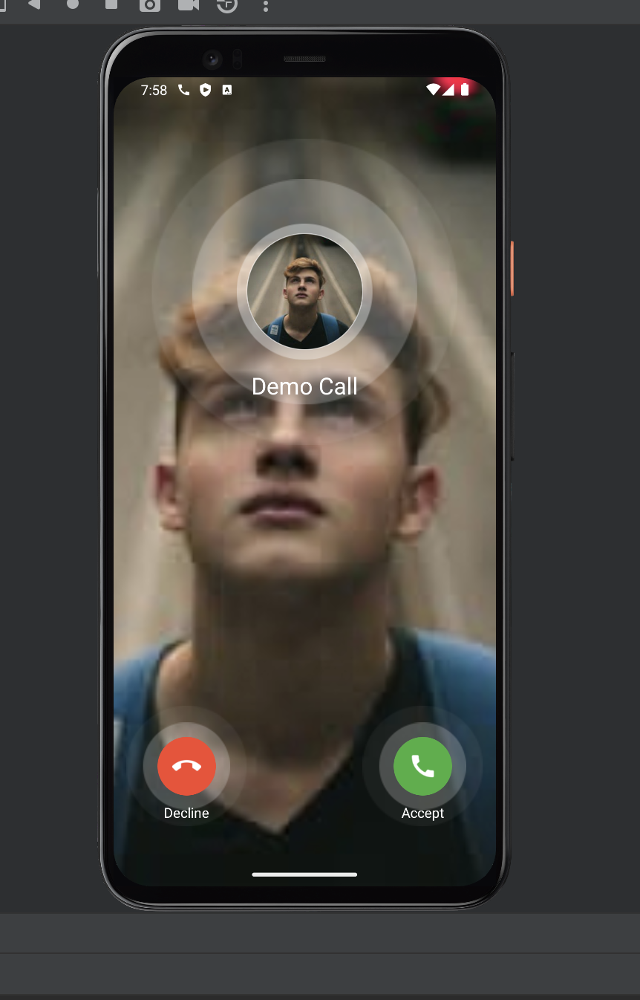

Similar to Flutter’s out-of-the-box `Container` widget, `StreamCallContainer` serves as a convenient widget for handling everything related to video and calling.

By default, `StreamCallContainer` subscribes to a given `call` and listens for state changes during the call's lifecycle.

When the user receives an incoming `ringing` call, the widget automatically updates its UI to display a ringing screen. Throughout the call lifecycle, the widget will further update itself to show the call screen and outgoing call screen based on the user's actions.



### Customizing Call Container

```dart
const StreamCallContainer({
    super.key,
    required this.call,
    this.callConnectOptions = const CallConnectOptions(),
    this.onBackPressed,
    this.onLeaveCallTap,
    this.onAcceptCallTap,
    this.onDeclineCallTap,
    this.onCancelCallTap,
    this.incomingCallBuilder,
    this.outgoingCallBuilder,
    this.callContentBuilder,
  });
```

Developers can easily respond to user actions, such as accepting or declining a call, by using exposed callbacks and builders.

To replace default screens, such as the one displayed when an incoming call is detected, developers can use one of the many optional builders available.

```dart
@override
  Widget build(BuildContext context) {
   return Scaffold(
    body: StreamCallContainer(
      call: widget.call,
      incomingCallBuilder: (context, call, callState) {
        return CustomIncomingCallScreen(call: call, state: callState);
      },
    ),
);
```

All the `builders` exposed by `StreamCallContainer` provide users with an ongoing `Call` object and the associated `CallState`. These can be used to subscribe to changes and display different UI options depending on the events.

If your use case does not require ringing, incoming, or outgoing capabilities similar to Google Meet, then our `CallScreen` widget may be a better option. Keep reading to learn how to use it in your application.
