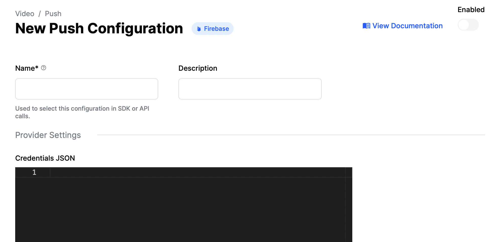
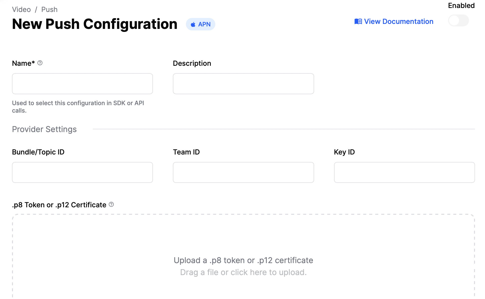

Adding Ringing And CallKit To Your Application

### Introduction

This guide details how to add an end-to-end call flow (ringing) to your Flutter application.

Ringing is done through a custom interface for Android and CallKit for iOS. An end-to-end call flow
allows you to add an immersive calling experience to your application.

Ringing requires push/VoIP notifications to be sent to your device. Stream Video sends push/VoIP notifications to members that have at least one registered device.

To receive push notifications from Stream Video, you'll need to:

1. Configure your push notification provider on the Stream Dashboard.
2. Add the client-side integration. For Flutter this guide demonstrates using Firebase Cloud Messaging (FCM) for Android and Apple Push Notification Service (APNs) for iOS devices.

### Integrating Firebase for Android

#### Step 1 - Get the Firebase Credentials

These credentials are the [private key file](https://firebase.google.com/docs/admin/setup#initialize_the_sdk_in_non-google_environments) for your service account, in Firebase console.

To generate a private key file for your service account in the Firebase console:

- Open Settings > Service Accounts.

- Click **Generate New Private Key**, then confirm by clicking **Generate Key**.

- Securely store the JSON file containing the key.

This JSON file contains the credentials that need to be uploaded to Stream’s server, as explained in the next step.

#### Step 2 - Upload the Firebase Credentials to Stream

You now need to upload your Firebase credentials using the Stream dashboard.

- Go to the dashboard of your video project at the [Stream website](https://dashboard.getstream.io).

- Open the **Push Notifications** tab under **Video & Audio**.

- Select **New Configuration** and select **Firebase**.



- Add a name for your push provider in the **Name** field. You will use this name later in the code to identify which provider to use for Android notifications.

- Add your previously generated Firebase Credentials in the **Credentials JSON** field.

- Enable this provider using toggle button.

- Click **Create** and your push provider should be ready.

#### Step 3 - Add dependencies to your app

To integrate push notifications in your Flutter app, you need to use the [`firebase_messaging`](https://pub.dev/packages/firebase_messaging) package.

Follow the [Flutter Firebase documentation](https://firebase.flutter.dev/docs/messaging/overview/#installation) to set up the plugin for Android and iOS.
Make sure you complete additional setup described [here](https://firebase.flutter.dev/docs/messaging/apple-integration/) and [here](https://firebase.google.com/docs/cloud-messaging/flutter/client).

Once that's done, FCM should be able to send push notifications to your devices.

#### Step 4 - Add native permissions

Add these permissions to `AndroidManifest.xml` in order to support video calling:

```xml
<uses-feature android:name="android.hardware.camera"/>
<uses-feature android:name="android.hardware.camera.autofocus"/>
<uses-permission android:name="android.permission.INTERNET"/>
<uses-permission android:name="android.permission.CAMERA"/>
<uses-permission android:name="android.permission.RECORD_AUDIO"/>
<uses-permission android:name="android.permission.ACCESS_NETWORK_STATE"/>
<uses-permission android:name="android.permission.CHANGE_NETWORK_STATE"/>
<uses-permission android:name="android.permission.MODIFY_AUDIO_SETTINGS"/>
<uses-permission android:name="android.permission.BLUETOOTH" android:maxSdkVersion="30"/>
<uses-permission android:name="android.permission.BLUETOOTH_ADMIN" android:maxSdkVersion="30"/>
<uses-permission android:name="android.permission.BLUETOOTH_CONNECT"/>
<uses-permission android:name="android.permission.POST_NOTIFICATIONS"/>
```

#### Step 5 - Add code to listen to push notifications

We recommend storing user credentials locally when the user logs in so you can log the user in when
a push notification is received.

- Add the following code in your `main.dart` as global functions to listen to background notifications:
- Replace `yourUserCredentialsGetMethod()` with your implementation to get logged in user credentials
- For `androidPushProvider` use the provider name created in [Step 2](#Step-2---Upload-the-Firebase-Credentials-to-Stream)
- For `iosPushProvider` use the provider name we will create later in [APN integration](#Integrating-APNs-for-iOS​)
- Add app icon Asset in Xcode for displaying in CallKit screen dedicated button (named `IconMask` in the code below). [See details here](https://developer.apple.com/documentation/callkit/cxproviderconfiguration/2274376-icontemplateimagedata)

```dart
// As this runs in a separate isolate, we need to setup the app again.
@pragma('vm:entry-point')
Future<void> _firebaseMessagingBackgroundHandler(RemoteMessage message) async {

  // Initialise Firebase
  await Firebase.initializeApp(options: DefaultFirebaseOptions.currentPlatform);

  try {
    // Get stored user credentials
    var credentials = yourUserCredentialsGetMethod();
    if (credentials == null) return;

    // Initialise StreamVideo
    StreamVideo(
      // ...
      // Make sure you initialise push notification manager
      pushNotificationManagerProvider: StreamVideoPushNotificationManager.create(
        iosPushProvider: const StreamVideoPushProvider.apn(
          name: 'your-ios-provider-name',
        ),
        androidPushProvider: const StreamVideoPushProvider.firebase(
          name: 'your-fcm-provider',
        ),
        pushParams: const StreamVideoPushParams(
          appName: kAppName,
          ios: IOSParams(iconName: 'IconMask'),
        ),
      ),
    );

    // Pass it along to the handler
    await _handleRemoteMessage(message);
  } catch (e, stk) {
    debugPrint('Error handling remote message: $e');
    debugPrint(stk.toString());
  }

  StreamVideo.reset();
}

Future<void> _handleRemoteMessage(RemoteMessage message) async {
  await StreamVideo.instance.handleVoipPushNotification(message.data);
}
```

The code upto this point handles calls for the background and foreground state of the app.
To handle calls from a terminated state, we need to add some additional code.

In a high-level widget, add this method and call it from the `initState()` method:
- add navigator key to MaterialApp widget: `navigatorKey: _navigatorKey`

```dart
final _navigatorKey = GlobalKey<NavigatorState>();

@override
void initState() {
  //...
  _tryConsumingIncomingCallFromTerminatedState();
}

void _tryConsumingIncomingCallFromTerminatedState() {
  if (_navigatorKey.currentContext == null) {
    // App is not running yet. Postpone consuming after app is in the foreground
    WidgetsBinding.instance.addPostFrameCallback((timeStamp) {
      _consumeIncomingCall();
    });
  } else {
    // no-op. If the app is already running we'll handle it via events
  }
}

Future<void> _consumeIncomingCall() async {
  final calls = await StreamVideo.instance.pushNotificationManager?.activeCalls();
  if (calls == null || calls.isEmpty) return;

  final call = await StreamVideo.instance.consumeIncomingCall(
    uuid: calls.first.uuid,
    cid: calls.first.callCid,
  );
}
```

#### Step 6 - Request notification permission from user

For Android 13+ you need to request the `POST_NOTIFICATIONS` permission. You can do it using the [permission_handler](https://pub.dev/packages/permission_handler) package.

Remember to follow [official best practices](https://developer.android.com/develop/ui/views/notifications/notification-permission#best-practices) (especially showing prompt before the request).

### Integrating APNs for iOS

#### Step 1 - Get the iOS certificate for push notifications

- Generate push notification service key [here](https://developer.apple.com/account/resources/certificates/add). Make sure you select **Apple Push Notifications service SSL (Sandbox & Production)**.

- You will need to create **Certificate Signing Request** - [follow this steps](https://developer.apple.com/help/account/create-certificates/create-a-certificate-signing-request)

- Convert the *aps.cer* file you created in the last step to a .p12 certificate file using keychain access. Make sure that you configure no password for the p12 file.
  - Add app.cer to login keychain
  - Find it in Certificate tab, right click and export as .p12 file
  - Remember not to set any password while exporting

#### Step 2 - Upload the certificate and create a push provider

- Go to the dashboard of your video project at the [Stream website](https://dashboard.getstream.io).

- Open the **Push Notifications** tab under **Video & Audio**.

- Select **New Configuration** and select **APN**.



- Add a name for your push provider in the **Name** field. This is the name used while setting up iOS push notifications in the code we did [earlier](#Step-5---Add-code-to-listen-to-push-notifications)

- Add your previously generated P12 file with your additional Apple information.

- Enable this provider using toggle button

- Click **Create** and your push provider should be ready.

#### Step 3 - Add dependencies

There are no dependencies on the Flutter side that you need to add specifically for iOS.

#### Step 4 - Add native permissions

Add these permissions to `Info.plist` in order to support video calling:

```plist
<key>NSCameraUsageDescription</key>
<string>$(PRODUCT_NAME) Camera Usage!</string>
<key>NSMicrophoneUsageDescription</key>
<string>$(PRODUCT_NAME) Microphone Usage!</string>
<key>UIApplicationSupportsIndirectInputEvents</key>
<true/>
<key>BGTaskSchedulerPermittedIdentifiers</key>
<array>
	 <string>$(PRODUCT_BUNDLE_IDENTIFIER)</string>
</array>
<key>UIBackgroundModes</key>
<array>
	<string>audio</string>
	<string>fetch</string>
	<string>processing</string>
	<string>remote-notification</string>
	<string>voip</string>
</array>
```

#### Step 5 - Add code to handle CallKit events

In a high-level widget in your app, add this code to listen to FCM messages:

```
@override
void initState() {
  ...
  _observeFcmMessages()
}

_observeFcmMessages() {
  FirebaseMessaging.onBackgroundMessage(_firebaseMessagingBackgroundHandler);
  _fcmSubscription = FirebaseMessaging.onMessage.listen(_handleRemoteMessage);
}
```

In a high-level widget in your app, add this code to listen to CallKit events:

```dart
final _callKitEventSubscriptions = Subscriptions();

@override
void initState() {
  ...
  _observeCallKitEvents()
}

void _observeCallKitEvents() {
  final streamVideo = StreamVideo.instance;
  _callKitEventSubscriptions.addAll([
    streamVideo.onCallKitEvent<ActionCallAccept>(_onCallAccept),
    streamVideo.onCallKitEvent<ActionCallDecline>(_onCallDecline),
    streamVideo.onCallKitEvent<ActionCallEnded>(_onCallEnded),
    // You can add additional events if you need to handle them
    // As an example, handling mute events from CallKit
  ]);
}

void _onCallAccept(ActionCallAccept event) async {
  final streamVideo = StreamVideo.instance;

  final uuid = event.data.uuid;
  final cid = event.data.callCid;
  if (uuid == null || cid == null) return;

  final call = await streamVideo.consumeIncomingCall(uuid: uuid, cid: cid);
  final callToJoin = call.getDataOrNull();
  if (callToJoin == null) return;

  var acceptResult = await callToJoin.accept();

  // Return if cannot accept call
  if(acceptResult.isFailure) {
    debugPrint('Error accepting call: $call');
    return;
  }

  // Data for next screen
  final extra = (
    call: callToJoin,
    connectOptions: const CallConnectOptions(),
  );

  // Navigate to next screen if needed
}

void _onCallDecline(ActionCallDecline event) async {
  final streamVideo = StreamVideo.instance;

  final uuid = event.data.uuid;
  final cid = event.data.callCid;
  if (uuid == null || cid == null) return;

  final call = await streamVideo.consumeIncomingCall(uuid: uuid, cid: cid);
  final callToReject = call.getDataOrNull();
  if (callToReject == null) return;

  final result = await callToReject.reject();
  if (result is Failure) {
    debugPrint('Error rejecting call: ${result.error}');
  }
}

void _onCallEnded(ActionCallEnded event) async {
  final streamVideo = StreamVideo.instance;

  final uuid = event.data.uuid;
  final cid = event.data.callCid;
  if (uuid == null || cid == null) return;

  final call = streamVideo.activeCall;
  if (call == null || call.callCid.value != cid) return;

  final result = await call.leave();
  if (result is Failure) {
    debugPrint('Error leaving call: ${result.error}');
  }
}

@override
void dispose() {
  // ...
  _callKitEventSubscriptions.cancelAll();
}
```

:::note
Remember to implement navigation in a marked line.
:::

Please add an additional extension at the end of the class / in a different file that we added to make
subscriptions simpler:

```dart
extension on Subscriptions {
  void addAll<T>(Iterable<StreamSubscription<T>?> subscriptions) {
    for (var i = 0; i < subscriptions.length; i++) {
      final subscription = subscriptions.elementAt(i);
      if (subscription == null) continue;

      add(i + 100, subscription);
    }
  }
}
```

If you need to manage the CallKit call, you can use the `StreamVideo.pushNotificationManager`. As an example, let's
say you want to end all calls on the CallKit side, you can end them this way:

```dart
StreamVideo.instance.pushNotificationManager?.endAllCalls();
```

#### Step 6 - Add native code to the iOS project

In your iOS project, add the following imports to your `AppDelegate.swift`:

```swift
import UIKit
import Flutter
import stream_video_push_notification
```

In the same file, add an extra line to your `AppDelegate` class which registers the app for push notifications:

```swift
override func application(
    _ application: UIApplication,
    didFinishLaunchingWithOptions launchOptions: [UIApplication.LaunchOptionsKey: Any]?
) -> Bool {
    GeneratedPluginRegistrant.register(with: self)

    // Register for push notifications.
    StreamVideoPKDelegateManager.shared.registerForPushNotifications()

    return super.application(application, didFinishLaunchingWithOptions: launchOptions)
}
```

### Registering a Device With Stream Backend

Once you configure a push provider and set it up on the Stream dashboard, a device that is supposed to receive push notifications needs to be registered on the Stream backend.

Device registration is carried out in the SDK every time a user logs in and does not need to be implemented in your app.
