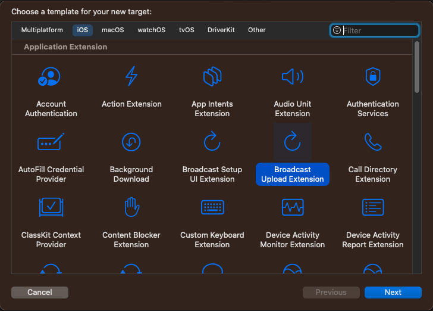
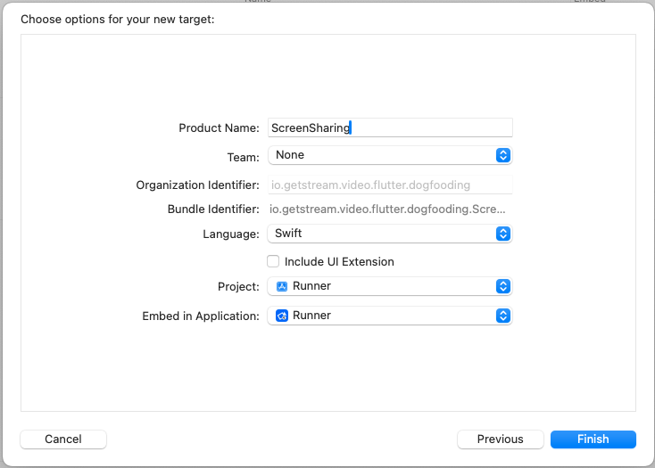
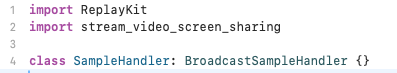

Adding option to share the screen during a call

### Introduction

Stream Video supports screen sharing during the call. This guide details how to configure it in your app.

### iOS

There are two options for screensharing from an iOS device:

- **in-app screensharing** - the screen is shared only while the app is active (in the foreground).
- **broadcasting** - the device shares the screen even when the app goes into the background.
Both of these options use Apple's framework ReplayKit (via [flutter_webrtc](https://pub.dev/packages/flutter_webrtc)) for broadcasting the user's screen.

:::info
  In order for a user to be able to share their screen, they must have the screenshare capability configured for the call they are in.
:::


#### In-app sharing

In-app screensharing broadcasts only the app's screens. When you are in a call, and you have the required capability, you can toggle screensharing by calling the `setScreenShareEnabled()` method. 

:::tip
If you use our UI components you can also add `ToggleScreenShareOption` as one of `StreamCallControls` option.
:::

When the method is invoked, ReplayKit will ask for the user's consent that their screen will be shared. Only after the permission is granted, the screensharing starts.

#### Broadcasting

In most cases, you would need to share your screen while you are in the background, to be able to open other apps. For this, you need to create a Broadcast Upload Extension.

##### Add dependencies

You will need a dependency to `stream_video_screen_sharing` for native iOS code needed. If you already have a dependency on our `stream_video_flutter` package you don't have to do anything more - it already depend on screen sharing package.

Otherwise add `stream_video_screen_sharing` to your dependencies, to do that just open `pubspec.yaml` and add it inside the dependencies section.

```yaml
dependencies:
  flutter:
    sdk: flutter
  
  stream_video_screen_sharing: ^0.1.1
```

##### Toggle screen sharing with broadcast mode

If you want to start screen sharing in broadcast mode on iOS you will need to toggle on using `ScreenShareConstraints`. Just set the flag to true inside `ToggleScreenShareOption` or when you use `call.setScreenShareEnabled()` directly.

```dart
const ScreenShareConstraints(
    useiOSBroadcastExtension: true,
),
```

##### Add Broadcast Upload Extension

Now add the extension, without UI, to your project in XCode:




:::warning
Make sure the deployment target for both your app and broadcast extension is set to iOS 14 or newer.
:::

After you create the extension, there should be a class called `SampleHandler`, that implements the `RPBroadcastSampleHandler` protocol. Remove the protocol conformance and the methods, import our `stream_video_screen_sharing`, and make the `SampleHandler` a subclass of our class called `BroadcastSampleHandler`, that internally handles the broadcasting.



:::tip
If xCode cannot find the `stream_video_screen_sharing` module add this code block to your app's Podfile file:

```Podfile
target 'ScreenSharing' do
  use_frameworks!
  pod 'stream_video_screen_sharing', :path => File.join('.symlinks', 'plugins', 'stream_video_screen_sharing', 'ios')
end
```

Replace `ScreenSharing` with your extension name.
:::

##### Setup app groups

Add your extension to an app group by going to your extension's target in the project. In the Signings & Capabilities tab, click the + button in the top left and add App Groups. If you haven't done so already, add App Groups to your main app as well, ensuring that the App Group identifier is the same for both.

##### Update Info.plist

Finally, you should add a new entries in the `Info.plist` files.
In **both the app and the broadcast extension**, add a key `RTCAppGroupIdentifier` with a value of the app group id and `RTCScreenSharingExtension` key with a value of a bundle id of your extension.

With that, the setup for the broadcast upload extension is done.

### Android

The Stream Video SDK has support for screen sharing from an Android device. The SDK is using the [Android Media Projection API](https://developer.android.com/guide/topics/large-screens/media-projection) for the capture. To initiate screen sharing, user consent is mandatory.

When using the `ToggleScreenShareOption` within the` stream_video_flutter` package, permission handling is seamlessly integrated. However, if you opt to initiate screen sharing via the `setScreenShareEnabled()` method on the `Call` object, you will be responsible for securing the necessary permissions and initiating a foreground service. The foreground service is essential for displaying a notification to the user while screen sharing is active.

Below is an example snippet that demonstrates how to use the [`flutter_background`](https://pub.dev/packages/flutter_background) package to manage these requirements:

```dart
Future<bool> startForegroundService() async {
  const androidConfig = FlutterBackgroundAndroidConfig(
    notificationTitle: 'You are screen sharing',
    notificationText: '',
    notificationImportance: AndroidNotificationImportance.High,
    shouldRequestBatteryOptimizationsOff: false,
  );

  //initialization will ask for a needed permissions
  await FlutterBackground.initialize(androidConfig: androidConfig);
  return FlutterBackground.enableBackgroundExecution();
}
```

In case of using `flutter_background` you will also need to add a media projection service declation in `AndroidManifest.xml`.

```xml
<service android:name="de.julianassmann.flutter_background.IsolateHolderService"
    android:foregroundServiceType="mediaProjection"
    android:enabled="true"
    android:exported="false"/>
```