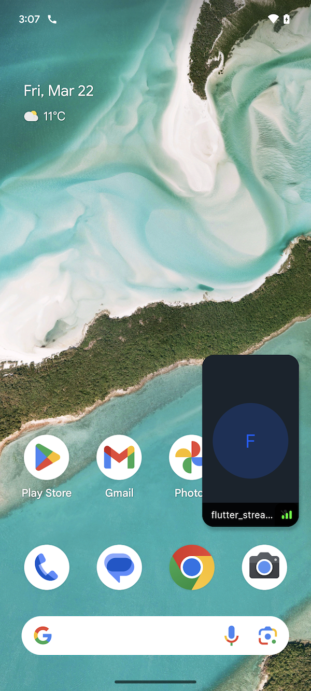

Picture in picture (PIP) keeps the call running and visible while you navigate to other apps.

:::info
  At the moment Picture in Picture is only supported on Android.
:::

### Enable Picture-in-Picture
You can enable Picture in Picture by setting the `enablePictureInPicture` property to `true` in the `StreamCallContainer` or `StreamCallContent` widget.

```dart
StreamCallContainer(
    call: widget.call,
    enablePictureInPicture: true,
)
```

You can customize the widget rendered while app is in Picture-in-Picture mode by providing `callPictureInPictureBuilder` to `StreamCallContent`.

```dart
StreamCallContainer(
    call: widget.call,
    callContentBuilder: (
      BuildContext context,
      Call call,
      CallState callState,
    ) {
      return StreamCallContent(
        call: call,
        callState: callState,
        enablePictureInPicture: true,
        callPictureInPictureBuilder: (context, call, callState) => // YOUR CUSTOM WIDGET
    })
```

### Android Configuration
To enable Picture in Picture on Android, you need to add the following configuration to your `AndroidManifest.xml` file.

```xml
<activity android:name="VideoActivity"
    android:supportsPictureInPicture="true"
    android:configChanges="screenSize|smallestScreenSize|screenLayout|orientation"
    ..
 />
```

Then you need to add this code to your `MainActivity` class. It will enter Picture in Picture mode when the user leaves the app but only if the call is active.

```kotlin
import io.flutter.embedding.android.FlutterActivity
import io.getstream.video.flutter.stream_video_flutter.service.PictureInPictureHelper

class MainActivity: FlutterActivity() {
    override fun onUserLeaveHint() {
        super.onUserLeaveHint()
        PictureInPictureHelper.enterPictureInPictureIfInCall(this)
    }
}
```

Done. Now after leaving the app, you'll see that the call will be still alive in the background like the one below:

