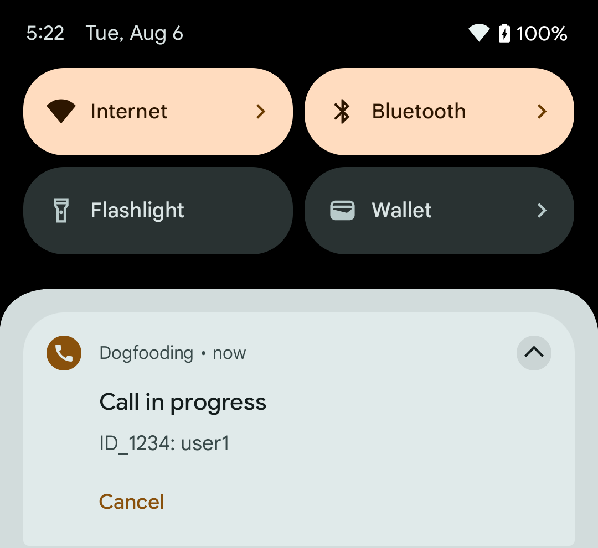
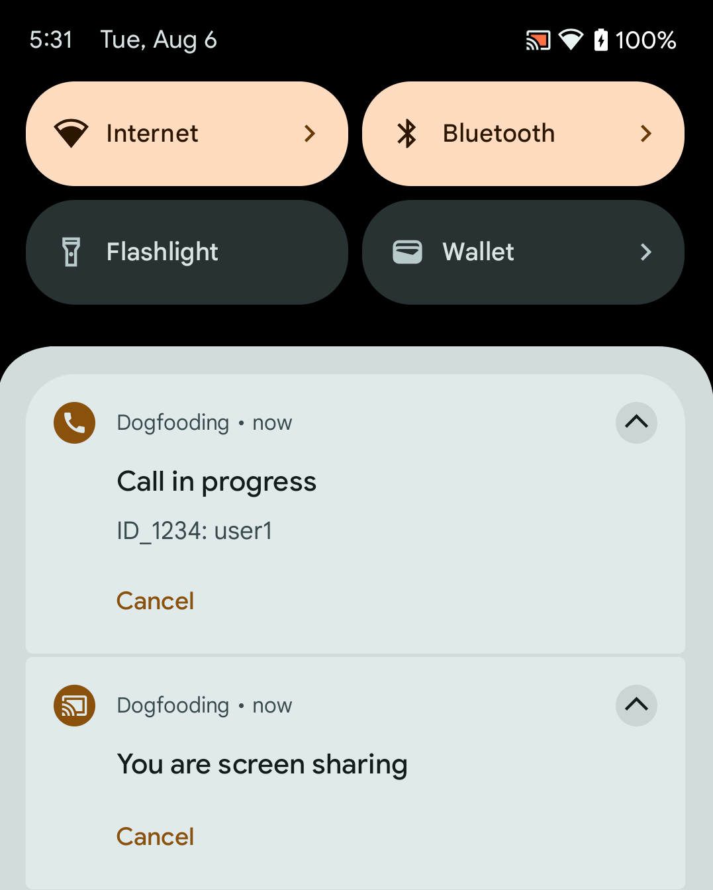
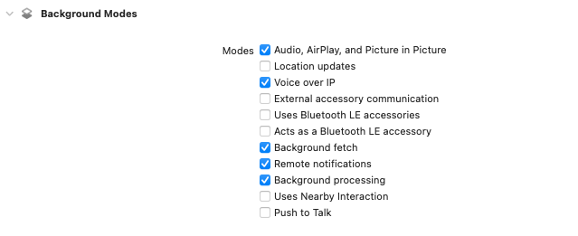

Ensuring that calls continue seamlessly when the app is in the background is essential for delivering a reliable and smooth user experience. On this page, you will learn how to make sure that calls remain active in the background on both Android and iOS.

## Android

Our SDK includes a dedicated service to keep calls active in the background, allowing users to multitask seamlessly.

### Starting the Android foreground service

Our SDK ensures continuous calls by initiating an Android foreground service. This service keeps the process active and the call running, even if the application's UI is no longer visible. The SDK already provides the required declarations in the manifest, all you have to do is to initialize the service somewhere after starting the app.

```dart
StreamBackgroundService.init(
      StreamVideo.instance,
);
```

Our foreground service displays a notification indicating an ongoing call. This notification allows users to either exit the call or seamlessly return to it. It appears during active calls and vanishes when the user leaves the call.



### Screen sharing notification

When a user shares their screen, the SDK displays a notification to indicate that the screen is being shared. This notification allows users to either stop sharing their screen or return to the call. It appears during active screen sharing and vanishes when the user stops sharing their screen.



### Customizing the notification

You can customize the notification by providing your own notification options. The SDK provides default options for both the call and screen sharing notifications. You can override these options by passing your own `NotificationOptionsBuilder` to the `init` method.

```dart
StreamBackgroundService.init(
      StreamVideo.instance,
      callNotificationOptionsBuilder: (call) {
        return const NotificationOptions(
          content: NotificationContent(
            title: 'Call Active',
            text: 'You are in a call',
          ),
          avatar: NotificationAvatar(
            url: '{url_to_avatar}',
          ),
        );
      },
);
```

### Handling notification clicks

You can handle notification clicks by providing callbacks to the `init` method. The callback is triggered when the user taps on the notification or on a notification button. You can use this callback to bring the call back to the foreground, cancel the call or perform any other action.

By default, the SDK handles button tap by canceling the call when the user taps on the call notification and canceling screen-sharing when tapped on the screen-sharing notification. You can override this behavior by providing your own `onButtonClick` callback.

```dart
 StreamBackgroundService.init(
      StreamVideo.instance,
      onButtonClick: (call, type, serviceType) async {
        switch (serviceType) {
          case ServiceType.call:
            // Add or replace with custom behavior
            await call.leave();
            await call.reject(reason: CallRejectReason.cancel());
          case ServiceType.screenSharing:
            // Add or replace with custom behavior
            StreamVideoFlutterBackground.stopService(ServiceType.screenSharing);
            call.setScreenShareEnabled(enabled: false);
        }
      },
    );
```

### Required permissions

We require the following permissions to create an appropriate foreground service: `FOREGROUND_SERVICE`, `FOREGROUND_SERVICE_PHONE_CALL`, and `FOREGROUND_SERVICE_MICROPHONE`. Additionally, the `FOREGROUND_SERVICE_MEDIA_PROJECTION` permission is necessary for the screen sharing functionality. They are added out-of-the-box in as part of our `stream_video_flutter` package.

## iOS

iOS background modes provide the necessary framework to maintain connectivity, handle incoming calls, and manage ongoing calls even when the app isn't in the foreground. By using the appropriate background modes, your app can stay responsive to call events without being suspended by the system.

### Enabling background modes

* In Xcode, go to your app's target, select the Signing & Capabilities tab.

* Click the + Capability button and add Background Modes.

* Check the relevant background modes, specifically:
  * Audio, AirPlay, and Picture in Picture: For ongoing audio/video calls while the app is in the background.
  * Voice over IP (VoIP): This mode is critical for managing incoming and ongoing voice calls.
  * Remote notifications
  * Background processing



### Info.plist

Make sure to add relevant permissions to your `Info.plist` file and `BGTaskSchedulerPermittedIdentifiers` to support background tasks.

```plist
<key>BGTaskSchedulerPermittedIdentifiers</key>
<array>
	 <string>$(PRODUCT_BUNDLE_IDENTIFIER)</string>
</array>
<key>UIBackgroundModes</key>
<array>
	<string>audio</string>
	<string>processing</string>
	<string>remote-notification</string>
	<string>voip</string>
</array>
```

## Picture in Picture (PiP)

To enhance the user experience even more, consider enabling Picture in Picture (PiP) mode. PiP allows users to continue watching videos or participating in calls while using other apps. Our SDK supports PiP mode on both iOS and Android, making it easy to enable this feature in your app. Check out our [Picture in Picture](https://getstream.io/video/docs/flutter/advanced/picture_in_picture/) guide to learn more.