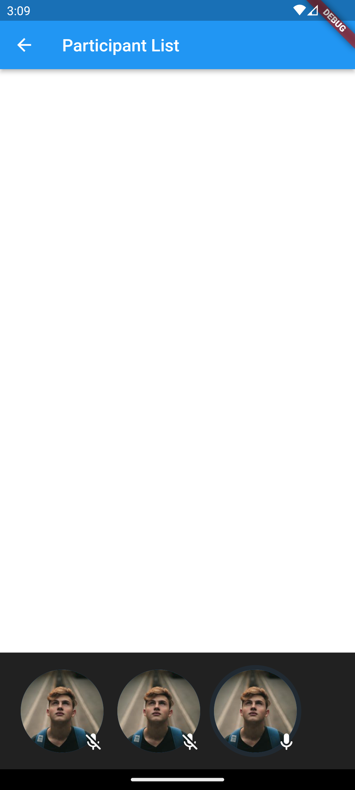
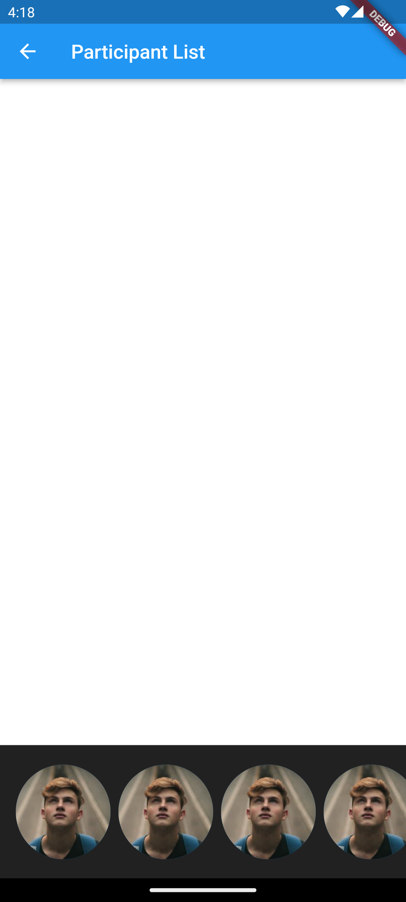

# Participant List

**Participant List** is the most important view for any video-related application. While UI Components package provides customizable [CallParticipants](../04-ui/03-components/02-participants/02-call-participants.mdx) component, you might
decide to develop your own view if the default's view customization level is not enough for you or you would rather have full control over the view.

The guide will go step-by-step through how to create a custom participant list using Stream Video LLC (Low-Level-Client). We'll cover the following topics:
1. How to connect a user to the call.
2. How to access and observe the call state.
3. How to render the participant list.
4. How to render a mute state for each participant.
5. How to highlight the dominant speaker.

By the end of this guide, your custom screen will look like this:

||
|---|

The guide assumes you know how to initialize the SDK and connect the user. Make sure to check [Introduction](../01-setup/01-introduction.mdx) if you want to know how to start.

Let's see how to implement this.

## Connecting to the call and observing the call state

Before building the actual view, let's take a look on how we can obtain and connect to the call using the Low-Level-Client. This needs to be done in two steps:

1. Get the call object using the `StreamVideo` class:

```dart
  final callCid = StreamCallCid.from(type: type, id: id);
  final data = await StreamVideo.instance.getOrCreateCall(cid: callCid);
  final call = Call.fromCreated(data: data.getDataOrNull()!.data);
```
//TODO Cover call options configuration once https://github.com/GetStream/stream-video-flutter/pull/278 is merged

You can see that as a first step, we need to create a `StreamCallCid` object based on `type` and `id`, later use a `StreamVideo` instance to get or create a call and lastly - use a factory method to create a `Call` object itself.

2. Connect the current user to the call obtained before:

```dart
  call.join();
```

That's it. From that point, we can start listening to call state updates. The easiest way to do that is by listening to the stream that can be accessed from the `Call` object:

```dart
    _subscription = widget.call.state.listen((callState) {

    });
```

The `CallState` class contains all of the information about the current call, for example: a list of participants, status, capabilities, etc. You can find more information about the call state itself [here](../03-core-concepts/03-call-state.mdx)

:::note
Remember about disposing the subscription if it's no longer needed.
:::

Let's combine the snippets presented above into a single `StatefulWidget`:

```dart
class ParticipantListScreen extends StatefulWidget {
  const ParticipantListScreen({super.key, required this.call});

  final Call call;

  @override
  State<ParticipantListScreen> createState() => _ParticipantListScreenState();
}

class _ParticipantListScreenState extends State<ParticipantListScreen> {

  late CallState _callState;
  StreamSubscription<CallState>? _subscription;

  @override
  void initState() {
    widget.call.join();

    _callState = widget.call.state.value;
    _subscription = widget.call.state.listen((callState) {
      setState(() {
        _callState = callState;
      });
    });

    super.initState();
  }

  @override
  void dispose() {
    _subscription?.cancel();
    super.dispose();
  }

  @override
  Widget build(BuildContext context) {
    return Container();
  }
}
```

Note that the `call` object is provided through the constructor in order not to unnecessarily recreate objects during hot reload.

## Implementing custom participants list

It's time to use the data and render call participants. As mentioned above, we'll rely on the information provided by the `callState`, and more specifically - `callState.callParticipants`. But before rendering the list, let's start with a single participant view:

```dart
class CallParticipantWidget extends StatelessWidget {
  const CallParticipantWidget({super.key, required this.callParticipantState});

  final CallParticipantState callParticipantState;

  @override
  Widget build(BuildContext context) {
    return CircleAvatar(
      radius: 48,
      backgroundImage: NetworkImage(
        callParticipantState.profileImageURL!,
      ),
    );
  }
}
```

The widget above receives a single participant state and renders a circular avatar using `profileImageURL`.

Now it's time to render all participants using a simple `ListView`:

```dart
class ParticipantListScreen extends StatefulWidget {
  const ParticipantListScreen({super.key, required this.call});

  final Call call;

  @override
  State<ParticipantListScreen> createState() => _ParticipantListScreenState();
}

class _ParticipantListScreenState extends State<ParticipantListScreen> {
  late CallState _callState;
  StreamSubscription<CallState>? _subscription;

  @override
  void initState() {
    widget.call.join();

    _callState = widget.call.state.value;
    _subscription = widget.call.state.listen((callState) {
      setState(() {
        _callState = callState;
      });
    });

    super.initState();
  }

  @override
  void dispose() {
    _subscription?.cancel();
    super.dispose();
  }

  @override
  Widget build(BuildContext context) {
    final callParticipants = _callState.callParticipants;

    return Scaffold(
      appBar: AppBar(
        title: const Text('Participant List'),
      ),
      body: _callState.status.isConnected
          ? Column(
              crossAxisAlignment: CrossAxisAlignment.stretch,
              children: [
                const Expanded(
                  flex: 5,
                  child: ColoredBox(color: Colors.white),
                ),
                Expanded(
                  child: ColoredBox(
                    color: Colors.black87,
                    child: ListView.separated(
                      padding: const EdgeInsets.symmetric(
                        vertical: 8,
                        horizontal: 16,
                      ),
                      itemBuilder: (context, index) {
                        return CallParticipantWidget(
                          callParticipantState: callParticipants[index],
                        );
                      },
                      separatorBuilder: (_, __) => const SizedBox(width: 8),
                      itemCount: callParticipants.length,
                      scrollDirection: Axis.horizontal,
                    ),
                  ),
                ),
              ],
            )
          : const Center(child: CircularProgressIndicator()),
    );
  }
}
```

You can note that we are checking if the call is already connected, by checking `_callState.status.isConnected`, before showing the actual participant list.

That's it. The list is implemented and will be automatically refreshed once the call status changes, for example: when participant joins or leaves. The code above renders the following screen:

||
|---|

Now, let's see how we can add more details to our single participant view.

## Rendering mute status and highlighting dominant speaker

Let's add more information to the single participant widget, starting from adding information if the participant is muted:

```dart
class CallParticipantWidget extends StatelessWidget {
  const CallParticipantWidget({super.key, required this.callParticipantState});

  final CallParticipantState callParticipantState;

  @override
  Widget build(BuildContext context) {
    return Stack(
      alignment: Alignment.bottomRight,
      children: [
        const CircleAvatar(
          radius: 48,
          backgroundImage: NetworkImage(
            callParticipantState.profileImageURL!,
          ),
        ),
        Icon(
          callParticipantState.isAudioEnabled
              ? Icons.mic_rounded
              : Icons.mic_off_rounded,
          color: Colors.white,
        )
      ],
    );
  }
}
```

The snippet above utilizes information provided by `callParticipantState` and renders different icons at the bottom right corner based on particular participant audio status.

You can check the result below:

||
|---|

As the last step, let's add a blue highlight for the participant who is currently an active speaker. We'll use an [external library](https://pub.dev/packages/avatar_glow) for that purpose:

Start with adding `avatar_glow: ^2.0.2` to the dependencies in `pubspec.yaml` file.

Next, let's slightly modify our `CallParticipantWidget`:

```dart
class CallParticipantWidget extends StatelessWidget {
  const CallParticipantWidget({super.key, required this.callParticipantState});

  final CallParticipantState callParticipantState;

  @override
  Widget build(BuildContext context) {
    return AvatarGlow(
      animate: callParticipantState.isDominantSpeaker,
      endRadius: 56,
      glowColor: Colors.blue,
      child: Stack(
        alignment: Alignment.bottomRight,
        children: [
          const CircleAvatar(
            radius: 48,
            backgroundImage: NetworkImage(
              callParticipantState.profileImageURL!,
            ),
          ),
          Icon(
            callParticipantState.isAudioEnabled
                ? Icons.mic_rounded
                : Icons.mic_off_rounded,
            color: Colors.white,
          )
        ],
      ),
    );
  }
}
```

That's all we need. The most important change was wrapping the widget created before with the `AvatarGlow` and starting the animation based on the `callParticipantState.isDominantSpeaker` flag. After this change, you will notice a glow effect around participant who is a dominant speaker:

||
|---|

Now, you're ready to experiment more and add feature to your custom participants list. Play around with the `CallState` and `CallParticipantState` and as a next step you might want to enhance your view with:

- Participant name
- Connection quality
- Participant's video track

and much more.
