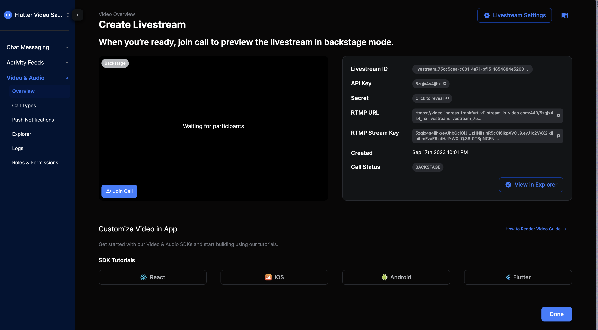

# Watching a Livestream

This sample walks you through building advanced UIs for watching a livestream on Flutter.

:::note
In this cookbook tutorial, we will assume that you already know how to join a livestream call. If you haven't familiarized yourself with the **[Livestream Tutorial](https://getstream.io/video/docs/flutter/livestreaming/)** yet, we highly recommend doing so before proceeding with this cookbook.
::::

To view an HLS stream and benefit from the full experience of selecting different streaming qualities and performing different player actions like muting and unmuting the stream, we recommend using [lecle_yoyo_player](https://pub.dev/packages/lecle_yoyo_player).

When building for livestreaming, there are a few considerations you need to keep in mind for the UI:

- UI for when the video isn't loaded yet
- A message to show when the livestream hasn't started yet
- What to show when the livestream stopped
- How to indicate when there are connection problems
- Number of participants
- Duration of the call

## Setting up the UI
To setup our UI for rendering a livestream, we can use Flutter’s built-in `StreamBuilder` widget for listening to changes in our call state and rendering different UIs based on the stage of our live stream:

```dart
@override
  Widget build(BuildContext context) {
    return SafeArea(
      child: StreamBuilder(
        stream: widget.call.state.valueStream,
        initialData: widget.call.state.value,
        builder: (context, snapshot) {
          final callState = snapshot.data!;
          return Stack(
            children: [
              if (snapshot.hasData && !callState.isBackstage)
								// TODO: Render Video

              if (snapshot.hasData && !callState.isBackstage)
							 // TODO: Render Participant Count

              if (!snapshot.hasData)
								// TODO: Render loading indicator

              if (snapshot.hasData && callState.isBackstage)
							 // TODO: Display message call is not live

            ],
          );
        },
      ),
    );
  }
}
```

By looking at different properties on our `CallState`, we can render different UIs and messages based on whether the call is live, backstage, or loading. A `Stack` also allows us to add different secondary live stream elements such as a view count above the main UI.

## Rendering the Livestream
Before running the code below to see the livestream in action, we recommend going to our [Dashboard](https://dashboard.getstream.io/) and creating a livestream first since it can be done visually without having to create another instance of the application on the simulator.

Once a stream is started on the dashboard, the `Livestream ID` can be passed to the `id` parameter for the `Call` object in code.



```dart
@override
  Widget build(BuildContext context) {
    return SafeArea(
      child: StreamBuilder(
        stream: widget.call.state.valueStream,
        initialData: widget.call.state.value,
        builder: (context, snapshot) {
          final callState = snapshot.data!;
          return Stack(
            children: [
              if (snapshot.hasData && !callState.isBackstage)
                _buildRender(callState),
              if (snapshot.hasData && !callState.isBackstage)
                Positioned(
                  top: 12.0,
                  left: 12.0,
                  child: Material(
                    shape: RoundedRectangleBorder(
                      borderRadius: BorderRadius.circular(24),
                    ),
                    color: Colors.red,
                    child: Center(
                      child: Padding(
                        padding: const EdgeInsets.all(8.0),
                        child: Text(
                          'Viewers: ${callState.callParticipants.length - 1}',
                          style: const TextStyle(
                            fontSize: 14,
                            color: Colors.white,
                            fontWeight: FontWeight.bold,
                          ),
                        ),
                      ),
                    ),
                  ),
                ),
              if (snapshot.hasData && (callState.isBackstage))
                const Material(
                  child: Center(
                    child: Text('Stream not live'),
                  ),
                ),
              if (!snapshot.hasData)
                const Center(
                  child: CircularProgressIndicator(),
                ),
            ],
          );
        },
      ),
    );
  }
}
```

To view our full list of Video examples, please check out our Flutter Cookbook on [GitHub](https://github.com/GetStream/flutter-video-samples).