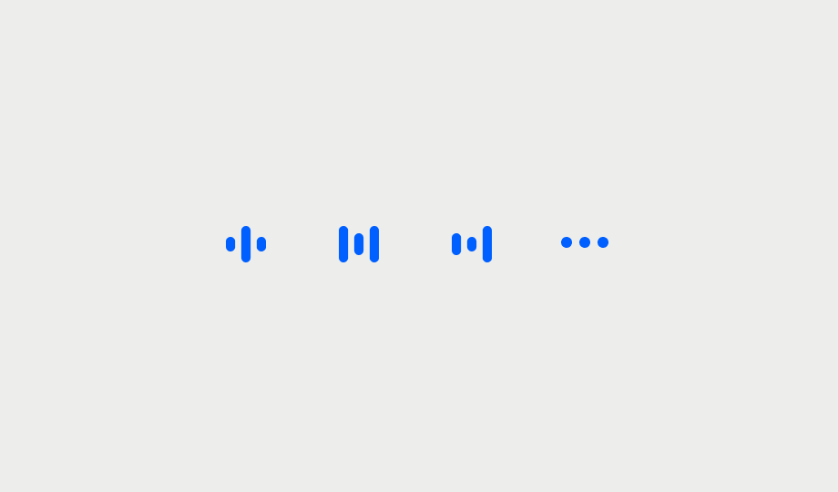

# Audio Volume Indicator

The audio indicator provides visual feedback when a user connected to the call is speaking.



You can observe several things about audio in the `CallParticipantState` class such as:

* Check if the current user is the dominant speaker: `participantState.isDominantSpeaker`
* Check if the current user is speaking: `participantState.isSpeaking`
* Check the audio level of the user: `participantState.audioLevel`

## Customising the audio volume indicator

You can change the color of the audio indicator using the `audioLevelIndicatorColor` parameter of the `StreamCallParticipant` widget:

```dart
StreamCallContainer(
  // ...
  callContentBuilder: (
    BuildContext context,
    Call call,
    CallState callState,
  ) {
    return StreamCallContent(
      call: call,
      callState: callState,
      callParticipantsBuilder: (
        BuildContext context,
        Call call,
        CallState callState,
      ) {
        return StreamCallParticipants(
          call: call,
          participants: callState.callParticipants,
          callParticipantBuilder: (
            BuildContext context,
            Call call,
            CallParticipantState participantState,
          ) {
            return StreamCallParticipant(
              call: call,
              participant: participantState,
              audioLevelIndicatorColor: Colors.teal,
            );
          },
        );
      },
    );
  },
),
```
