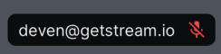

# Participant Labels

Showing participant info is an important part of the calling experience, and can have different design variations.
By default, the SDK shows the name of the participant with white color, in a black `DecoratedBox` with opacity 0.5.
Additionally, it also displays an audio indicator at the end by default.



## Customising the participant label

You can change the `TextStyle` and alignment of the label using the `participantLabelTextStyle` and `participantLabelAlignment` parameters
of the `StreamCallParticipant` widget respectively:

```dart
StreamCallContainer(
  // ...
  callContentBuilder: (
    BuildContext context,
    Call call,
    CallState callState,
  ) {
    return StreamCallContent(
      call: call,
      callState: callState,
      callParticipantsBuilder: (
        BuildContext context,
        Call call,
        CallState callState,
      ) {
        return StreamCallParticipants(
          call: call,
          participants: callState.callParticipants,
          callParticipantBuilder: (
            BuildContext context,
            Call call,
            CallParticipantState participantState,
          ) {
            return StreamCallParticipant(
              call: call,
              participant: participantState,
              participantLabelAlignment: Alignment.centerLeft,
              participantLabelTextStyle: const TextStyle(
                fontWeight: FontWeight.bold,
              ),
            );
          },
        );
      },
    );
  },
),
```


