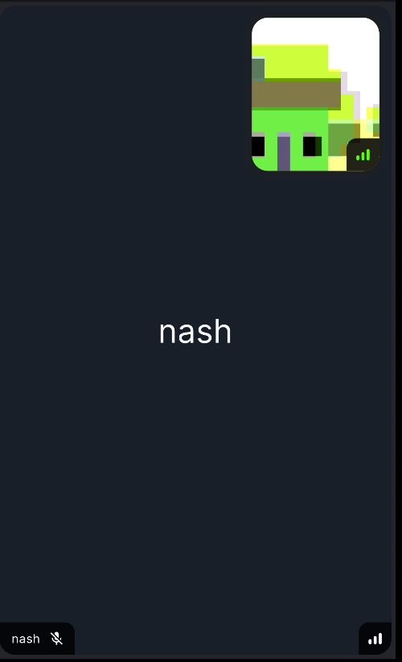

# Video Fallback

Video fallbacks are shown when the user's video track is disabled and ensures all participants are
identifiable in a video calling experience.



## Adding a video fallback

When building your own video experience, you may want to customise the widget shown to users when a
video track is disabled. You can do this via the `videoPlaceholderBuilder` parameter of the
`StreamCallParticipant` widget:

```dart
StreamCallContainer(
  call: call,
  callConnectOptions: options,
  callContentBuilder: (context, call, state) {
    return StreamCallContent(
      call: call,
      callState: state,
      callParticipantsBuilder: (context, call, state) {
        return StreamCallParticipants(
          call: call,
          participants: state.callParticipants,
          callParticipantBuilder: (context, call, state) {
            return StreamCallParticipant(
              call: call,
              participant: state,
              videoPlaceholderBuilder: (context, call, state) {
                // Build your placeholder here
                return Center(
                  child: Text(
                    state.name,
                    style: TextStyle(fontSize: 32),
                  ),
                );
              },
            );
          },
        );
      },
    );
  },
),
```
