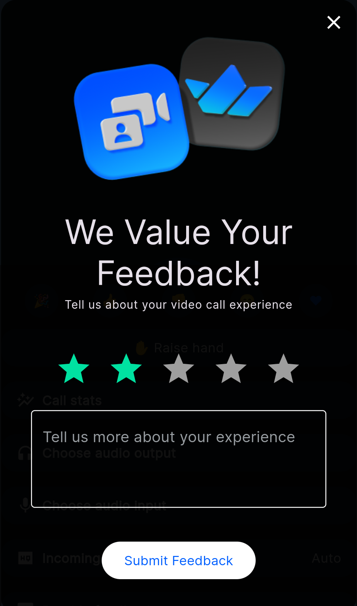

## Call Quality Rating

In this guide, we are going to show how one can build a call quality rating form on top of our Flutter Video SDK.
It is a good practice to ask your end users about their overall experience after the end of the call or, while being in a call.

Here is a preview of the component we are going to build:


## Submit Feedback API

Our Flutter Video SDK provides an API for collecting this feedback which later can be seen in the call stats section of our dashboard.

```dart
await call.collectUserFeedback(
    rating: // a rating grade from 1 - 5,
    reason: // optional reason message,
    custom: {
      // ... any extra properties that you wish to collect
    },
);
```

## Implementation

One way to ask for feedback is to show a dialog with a rating scale and an optional text field for the user to provide additional comments when they leave the call:

```dart
StreamCallContainer(
    call: widget.call,
    onLeaveCallTap: () async {
        // Leave the call
        await widget.call.leave();

        // Show the feedback dialog
        await showDialog<void>(
            context: context,
            builder: (BuildContext context) {
                return FeedbackWidget(call);
            },
        );
    },
    ...
);
```

Lets implement a simple widget that will show the feedback form:

```dart
class FeedbackWidget extends StatefulWidget {
  FeedbackWidget(
    this.call, {
    super.key,
  });

  Call call;

  @override
  State<FeedbackWidget> createState() => _FeedbackWidgetState();
}

class _FeedbackWidgetState extends State<FeedbackWidget> {
  int value = 0;
  TextEditingController textController = TextEditingController();

  @override
  Widget build(BuildContext context) {
    return Padding(
      padding: const EdgeInsets.symmetric(horizontal: 16.0),
      child: Scaffold(
        backgroundColor: Colors.transparent,
        body: Align(
          alignment: Alignment.center,
          child: Stack(
            children: [
              Container(
                padding:
                    const EdgeInsets.symmetric(horizontal: 32, vertical: 32),
                decoration: BoxDecoration(
                  color: Colors.black87,
                  borderRadius: BorderRadius.circular(16),
                ),
                child: Column(
                  mainAxisSize: MainAxisSize.min,
                  mainAxisAlignment: MainAxisAlignment.center,
                  children: [
                    Image.asset(
                      streamVideoIconAsset,
                      width: 250,
                    ),
                    const SizedBox(height: 16),
                    Text(
                      'We Value Your Feedback!',
                      textAlign: TextAlign.center,
                      style: Theme.of(context).textTheme.displaySmall,
                    ),
                    const SizedBox(height: 4),
                    Text(
                      'Tell us about your video call experience',
                      textAlign: TextAlign.center,
                      style: Theme.of(context).textTheme.labelMedium,
                    ),
                    const SizedBox(height: 32),
                    Row(
                      mainAxisAlignment: MainAxisAlignment.center,
                      children: [
                        ...[1, 2, 3, 4, 5].map((rating) {
                          return IconButton(
                            icon: Icon(
                              Icons.star,
                              size: 40,
                              color: rating <= value
                                  ? AppColorPalette.appGreen
                                  : Colors.grey,
                            ),
                            onPressed: () {
                              setState(() {
                                value = rating;
                              });
                            },
                          );
                        }),
                      ],
                    ),
                    const SizedBox(height: 16),
                    TextField(
                      controller: textController,
                      decoration: const InputDecoration(
                        hintText: 'Tell us more about your experience',
                        hintStyle:
                            TextStyle(color: AppColorPalette.secondaryText),
                        border: OutlineInputBorder(),
                      ),
                      textInputAction: TextInputAction.done,
                      onSubmitted: (value) {
                        FocusManager.instance.primaryFocus?.unfocus();
                      },
                      style: const TextStyle(color: Colors.white),
                      maxLines: 3,
                    ),
                    const SizedBox(height: 32),
                    ElevatedButton(
                        onPressed: value > 0
                            ? () async {
                                final result =
                                    await widget.call.collectUserFeedback(
                                  rating: value,
                                  reason: textController.text,
                                );

                                result.fold(success: (_) {
                                  context.pop();

                                  ScaffoldMessenger.of(context).showSnackBar(
                                    const SnackBar(
                                      content:
                                          Text('Thank you for your feedback!'),
                                    ),
                                  );
                                }, failure: (error) {
                                  ScaffoldMessenger.of(context).showSnackBar(
                                    SnackBar(
                                      content: Text(
                                          'Failed to submit feedback: $error'),
                                    ),
                                  );
                                });
                              }
                            : null,
                        child: const Text('Submit Feedback'))
                  ],
                ),
              ),
              Positioned(
                right: 0,
                top: 0,
                child: IconButton(
                  icon: const Icon(Icons.close, color: Colors.white),
                  onPressed: () => context.pop(),
                ),
              ),
            ],
          ),
        ),
      ),
    );
  }
}
```

This widget will show a dialog with a rating scale and a text field for the user to provide additional comments. When the user submits the feedback, we call the `collectUserFeedback` method on the call object and show a success or error message accordingly.

That's it. You have successfully implemented a call quality rating dialog using our Flutter Video SDK. You can now ask your users to rate their call experience and collect valuable feedback that can help you improve your video calling experience.
