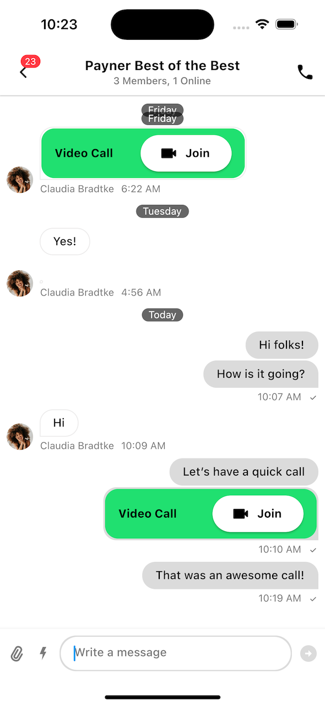
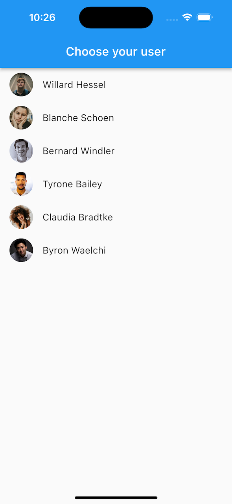
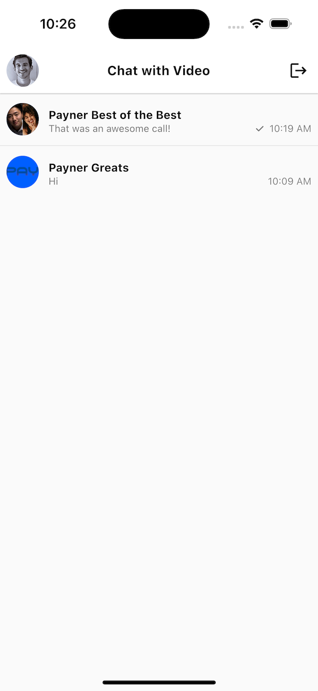
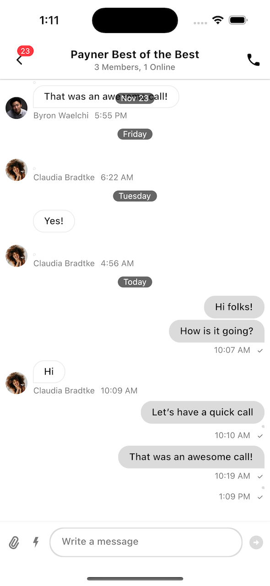
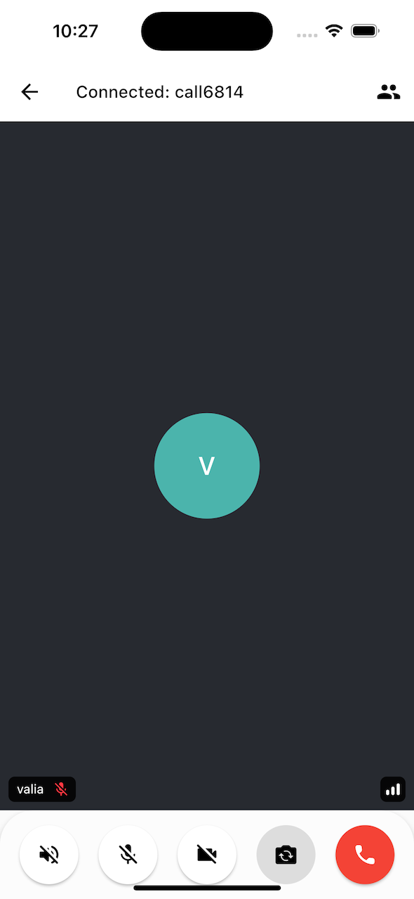

# Building Chat Apps With Video Support

One of the most common chat app use cases is having a chat feature in your app that allows users to engage in audio and video communication. This direct integration allows for a simple transition between text and images to more complex media.

Stream supports this use case, out-of-the-box. In this guide, you'll walk through all the steps required to integrate our Chat and Video Flutter SDKs into a cohesive whole. You'll cover the following:

* Adding Stream dependencies.
* Creating Stream clients.
* Authenticating Chat and Video users.
* Building custom Call attachments and "Start Call" UI.

By the end of this guide, your app will look like this:

||
|---|

You'll have the ability to create messaging conversations, in which you can start calls as a custom attachment. Anyone in the chat will then be notified accordingly and can join the call.

Let's see how to implement this.

## Creating the project

The easiest way to get a project working is using one of our [Starter Kits](https://github.com/GetStream/stream-video-flutter/tree/main/examples/chat_with_video). Within the `chat_with_video` directory, open `chat_with_video_starter` in your IDE.

> **Note**: Within the `chat_with_video` parent, there is a `chat_with_video_final` project that contains the final code for this guide. You can skip the starter kit and open that project instead if you want to see the finished solution.

Run `flutter pub get` to install the dependencies declared in `pubspec.yaml`:

```yaml title="/pubspec.yaml"
dependencies:
  flutter:
    sdk: flutter

  # Stream Chat SDK
  stream_chat_flutter: 5.2.0

  # Stream Video SDK
  stream_video_flutter:
    path: ../../../stream_video_flutter // TODO: Replace with published dependency
```

You'll be integrating two SDKs - Video and Chat. In the snippet above we declared dependencies for both of them.

The project already has a few screens set up for you with TODO items that you'll fill in later. Run the project and you should see the Login screen, followed by a blank Home screen after you select a user.

| Login Screen                                                | Home Screen                                                  |
|-------------------------------------------------------------|--------------------------------------------------------------|
|  |  |

The pre-baked code contains all the logic that is not related to Stream, so that you can focus solely on integrating our two SDKs. We recommend exploring the project to learn how to navigate it and what each part of the predefined code does. Some of the notable functionality in the starter kit contains:

- `main.dart` contains an entry point for our application.
- `app_config.dart` contains sample users, with Chat and Video tokens prepared.
- `login_screen.dart`, `channel_list_screen.dart` and `channel_screen.dart` contain screens for a default messaging app navigation. Most of these are empty for now, you'll fill them in.
- `call_attachment.dart` contains a custom attachment that users will use to join a call.

Now that you have an overview of the starter project, let's start integrating the SDKs.

## Integrating the Chat SDK

The first step of integrating our [Stream Chat SDK](https://getstream.io/chat/flutter/tutorial/) is initializing the `StreamChatClient`. You'll do that in the `main.dart` file, as it's recommended to initialize the client as soon as your app is launched. On top of that, you'll have to log in as a user, to fetch their information and conversations.

### Creating the Client

Open the `main.dart` file and replace the Stream Chat SDK initialization section with the following:

```dart title="/lib/main.dart"
final client = StreamChatClient(
  "tp8sef43xcpc",
  logLevel: Level.INFO,
);
```

Then, you need to pass the client to `MyApp` widget and wrap the client into `StreamChat` widget:

```dart title="/lib/main.dart"
class MyApp extends StatelessWidget {
  const MyApp({
    Key? key,
    required this.client,
  }) : super(key: key);

  final StreamChatClient client;

  @override
  Widget build(BuildContext context) {
    return MaterialApp(
      builder: (context, child) => StreamChat(
        client: client,
        child: child,
      ),
      home: LoginScreen(),
    );
  }
}
```

The final result should look like this:

```dart title="/lib/main.dart"
import 'package:chat_with_video_starter/screen/login_screen.dart';
import 'package:flutter/material.dart';
import 'package:stream_chat_flutter/stream_chat_flutter.dart';

void main() {
  final client = StreamChatClient(
    "tp8sef43xcpc",
    logLevel: Level.INFO,
  );

  /// TODO: Initialize Stream Video SDK.

  runApp(MyApp(client: client));
}

class MyApp extends StatelessWidget {
  const MyApp({
    Key? key,
    required this.client,
  }) : super(key: key);

  final StreamChatClient client;

  @override
  Widget build(BuildContext context) {
    return MaterialApp(
      builder: (context, child) => StreamChat(
        client: client,
        child: child,
      ),
      home: LoginScreen(),
    );
  }
}
```

There are several important things to notice here:

- The Stream Chat API client is initialized with your API Key.
- The client is then passed to the top-level `StreamChat` inherited widget that will provide the client to all the child widgets.

With this client initialization, you can proceed to log in a user when you choose them on the login screen.

### Logging in a User

Open `login_screen.dart` and replace `_connectChatUser` with the following:

```dart title="/lib/screen/login_screen.dart"
Future<void> _connectChatUser(BuildContext context, SampleUser user) async {
  final chatClient = StreamChat.of(context).client;
    
  await chatClient.connectUser(
    user.toChatUser(),
    user.chatToken,
  );
}
```

On the login screen, when you select a user, you call `_connectChatUser`. This lets you set up the user for Chat SDK. In this case, you're doing the following:

1. You obtain the `StreamChatClient` instance from `StreamChat`.
2. You map a `SampleUser` into a `User` object from the Chat SDK.
3. You pass in the `user` to `chatClient.connectUser()`.

To finish up, you can add the logging out counterpart, by replacing `_disconnectChatUser` with the following:

```dart title="/lib/screen/login_screen.dart"
Future<void> _disconnectChatUser(BuildContext context) async {
  final chatClient = StreamChat.of(context).client;

  await chatClient.disconnectUser();
}
```

With all this, you'll be able to log in and log out any user from our predefined data set. The next step is to display their conversations.

### Implementing Channel List Screen

There isn't much to the channel list screen - it'll show a list of `Channel`s the user is a member of and let them open those `Channel`s. It'll also feature a custom header to allow the user to log out at will.

Most of the navigation functionality, like opening a `Channel` and logging out is already there, you just need to use our Flutter UI Components to implement the UI.

Open `channel_list_screen.dart`. Add the following code to `_ChannelListScreenState`, to initialize the `StreamChannelListController`, that'll help you load, fetch and display the required data:

```dart title="/lib/screen/channel_list_screen.dart"
late final _listController = StreamChannelListController(
  client: StreamChat.of(context).client,
  filter: Filter.in_(
    'members',
    [StreamChat.of(context).currentUser!.id],
  ),
  channelStateSort: const [SortOption('last_message_at')],
);

@override
void dispose() {
  _listController.dispose();
  super.dispose();
}
```

While this is a simple piece of code, there are a few steps to analyze:

1. You obtain the `StreamChatClient` instance from `StreamChat`.
2. The controller requires the `StreamChatClient` instance to communicate with the API, a `channelStateSort` to define the order of the `Channel`s and `filter` to specify which `Channel`s we want to fetch.
3. Finally, we need to dispose the controller in the `dispose()` method.

With the `StreamChannelListController` ready, add the following code to the `build()` method. Specifically, you'll add a header that will allow the user to log out and a component that shows a list of channels and lets you open the `ChannelScreen`.

```dart title="/lib/screen/channel_list_screen.dart"
@override
Widget build(BuildContext context) {
  return Scaffold(
    appBar: StreamChannelListHeader(
      titleBuilder: (context, status, client) {
        return Text(
          "Chat with Video",
          style: StreamChatTheme.of(context).textTheme.headlineBold,
        );
      },
      actions: [
        IconButton(
          icon: const Icon(
            color: Colors.black,
            Icons.logout,
          ),
          onPressed: () async => widget.onLogout.call(),
        ),
      ],
    ),
    body: StreamChannelListView(
      controller: _listController,
      onChannelTap: (channel) {
        Navigator.of(context).push(
          MaterialPageRoute(
            builder: (context) {
              return StreamChannel(
                channel: channel,
                child: ChannelScreen(),
              );
            },
          ),
        );
      },
    ),
  );
}
```

The final result should look like this:

```dart title="/lib/screen/channel_list_screen.dart"
import 'package:flutter/material.dart';
import 'package:stream_chat_flutter/stream_chat_flutter.dart';

import 'channel_screen.dart';

class ChannelListScreen extends StatefulWidget {
  const ChannelListScreen({Key? key, required this.onLogout}) : super(key: key);

  final VoidCallback onLogout;

  @override
  State<ChannelListScreen> createState() => _ChannelListScreenState();
}

class _ChannelListScreenState extends State<ChannelListScreen> {
  late final _listController = StreamChannelListController(
    client: StreamChat.of(context).client,
    filter: Filter.in_(
      'members',
      [StreamChat.of(context).currentUser!.id],
    ),
    channelStateSort: const [SortOption('last_message_at')],
  );

  @override
  void dispose() {
    _listController.dispose();
    super.dispose();
  }

  @override
  Widget build(BuildContext context) {
    return Scaffold(
      appBar: StreamChannelListHeader(
        titleBuilder: (context, status, client) {
          return Text(
            "Chat with Video",
            style: StreamChatTheme.of(context).textTheme.headlineBold,
          );
        },
        actions: [
          IconButton(
            icon: const Icon(
              color: Colors.black,
              Icons.logout,
            ),
            onPressed: () async => widget.onLogout.call(),
          ),
        ],
      ),
      body: StreamChannelListView(
        controller: _listController,
        onChannelTap: (channel) {
          Navigator.of(context).push(
            MaterialPageRoute(
              builder: (context) {
                return StreamChannel(
                  channel: channel,
                  child: ChannelScreen(),
                );
              },
            ),
          );
        },
      ),
    );
  }
}
```

There are only a few lines of code here that let you set up an entire screen and lots of functionality:

1. You add the `StreamChannelListHeader` component that displays a title and allows for a few handlers and widget builders. In this case, you override the `actions` section to show a button used to log out the user from the app.
2. Using the `_listController`, you render a `StreamChannelListView`, which shows a list of `Channel`s. Overriding `onChannelTap`, lets you set up functionality when a user selects any `Channel`. In your case, you navigate to `ChannelScreen`.
3. Notice how the selected channel is provided to `ChannelScreen` via the `StreamChannel` inherited widget.

Build and run the app and you should be able to log in or out with a user, as well as see and open the `Channel`s they're a part of.

|  |
|------------------------------------------------------------------|

The next step to integrating the Chat SDK to replicate a chat-first-app that allows video calls, is to display the selected conversations and integrate custom attachments that render created calls.

### Adding Messaging Functionality

You're able to open the `ChannelScreen`, but it's fully empty at the moment. Let's change that. Open `ChannelScreen` and at the very top of the class, add the UI code:

```dart title="/lib/screen/channel_screen.dart"
@override
Widget build(BuildContext context) {
  return Scaffold(
    appBar: StreamChannelHeader(
      actions: <Widget>[
        IconButton(
          icon: const Icon(
            Icons.call_rounded,
            color: Colors.black,
          ),
          onPressed: () async => _startCall(context),
        ),
      ],
    ),
    body: Column(
      children: <Widget>[
        Expanded(
          child: StreamMessageListView(
            messageBuilder: (context, details, messages, defaultMessage) {
              return defaultMessage.copyWith(
                  customAttachmentBuilders: _customAttachmentBuilders());
            },
          ),
        ),
        StreamMessageInput(),
      ],
    ),
  );
}
```

The block of code here is mostly straightforward, as you're just composing a `ChannelScreen`, with some custom UI. Let's go over it:

1. You add a `topBar` to the `Scaffold`, using `StreamChannelHeader`. Overriding the `actions` allows you to set custom UI and behavior when the user interacts with that UI component, such as creating a Call.
2. You add `StreamMessageListView`, with a list of `customAttachmentBuilders`. This will be important, as you'll serve the `Channel` with custom Call attachments that let users join a video call.
3. Finally, you add `StreamMessageInput` with no special customization.

Build and run the app now and try opening a channel. You should see something like this:

||
|---|---|

You have a full integration of chat features in your app now. You can see channels, open them, send messages and attachments, start threads and much more. If you notice that some of the messages appear to be missing, that's because our SDK is trying to render custom Call attachments, but it doesn't yet know how.

For that to work, you need to add custom attachment builders to the SDK. There is already a custom attachment builder prepared for you, you just need to pass it to `StreamMessageListView`.

### Supporting Custom Attachments

Open the `call_attachment.dart` file. Explore it to familiarize yourself with the logic behind the UI it shows and the way it allows users to join the call using the following snippet:

```dart title="/lib/screen/attachment/call_attachment.dart"
Future<Call> _joinCall(BuildContext context, String cid) async {
  final parts = cid.split(':');
  final type = parts[0];
  final id = parts[1];

  final call = await StreamVideo.instance.joinCall(type: type, id: id);
  await call.join();
  return call;
}
```

It consumes the data stored in the custom attachment to join a call. Right now, the `StreamVideo` instance is not yet set up, as you'll do that in the final step of the guide.

To add the custom attachment builder, open the `channel_screen.dart` file and replace the `_customAttachmentBuilders` method with the following:

```dart title="/lib/screen/channel_screen.dart"
Map<String, AttachmentBuilder> _customAttachmentBuilders() {
  return {
    'custom': (context, message, attachments) {
      return WrapAttachmentWidget(
        attachmentWidget: CallAttachment(
          message: message,
          attachment: attachments.first,
        ),
        attachmentShape: RoundedRectangleBorder(
          borderRadius: BorderRadius.circular(12),
        ),
      );
    }
  };
}
```

Build and run the app now and your custom Call attachments should render properly.


Great, you're ready to join calls. But for that, you need to integrate the Stream Video Flutter SDK.

## Integrating the Video SDK

To successfully connect to a Call, you need to use its `callCid` to get the detailed information and join it. The internal process of joining a Call has several steps, such as measuring the latency and choosing the best server to connect through, but all you care about now is the trigger to join a Call and show the corresponding UI.

Firstly, you need to initialize the Video client, aptly called `StreamVideo`.

### Initializing StreamVideo

Open `main.dart`. To initialize the client, you need to add the following lines:

```dart title="/lib/main.dart"
StreamVideo.init(
  "us83cfwuhy8n",
  logLevel: Level.INFO,
);
```

You're now ready to log in the user and connect to a call when tapping on the custom attachment or header action.

### Logging in a User

For the login aspect of `StreamVideo`, there's not much to think about. The `StreamVideo` client is tied to a user instance. You cannot access any potential Calls or join an audio/video call, unless you're logged in. It's a server requirement and it makes things easy to think about.

Open the `login_screen.dart` file and replace the `_connectVideoUser` code with the following:

```dart title="/lib/screen/login_screen.dart"
Future<void> _connectVideoUser(SampleUser user) async {
  final videoClient = StreamVideo.instance;

  await videoClient.connectUser(
    user.toVideoUser(),
    token: Token(user.videoToken),
  );
}
```

It's very simple in what it does:

1. You obtain a singleton instance of `StreamVideo`.
2. You call the `connectUser()` function, with a sample user mapped to a user from the Video SDK.
4. You pass in a `Token` to make API calls.

With all of this, your attachments will be able to hit the Video API endpoints to join a call.

To finish up, you can add the logging out counterpart, by replacing `_disconnectVideoUser` with the following:

```dart title="/lib/screen/login_screen.dart"
Future<void> _disconnectVideoUser() async {
  final videoClient = StreamVideo.instance;

  await videoClient.disconnectUser();
}
```

### Allowing Users To Start Calls

Open the `channel_screen.dart` file and find `_startCall()`. Within it, add the following code:

```dart title="/lib/screen/channel_screen.dart"
void _startCall(BuildContext context) async {
  final currentUser = StreamChat.of(context).currentUser;
  final channel = StreamChannel.of(context).channel;

  final createCallResult = await StreamVideo.instance.createCall(
    id: 'call${Random().nextInt(10000)}',
    type: "default",
    ringing: false,
    participantIds: [],
  );

  final call = createCallResult.call;

  channel.sendMessage(
    Message(
      attachments: [
        Attachment(
          type: "custom",
          authorName: currentUser?.name ?? "",
          uploadState: UploadState.success(),
          extraData: {
            "callCid": call.callCid,
          },
        )
      ],
    ),
  );
}
```

This snippet is larger than the previous integration steps, but it packs a few things to keep in mind when creating a Call:

1. You're able to `createCall()` by passing in a Call ID, its `type`, if you want to ring anyone in the Call and its `participantIds`. For simplicity, you'll create **meeting calls**, which don't require any initial Participants or ringing.
2. If the API call is successful, you can proceed to build the Call attachment. If the API call fails, you can show custom UI to the user, but in this case we'll just ignore that case.
3. To build the `Attachment`, you use its constructor, which lets you define the type of the `Attachment`, its author and any `extraData` you might need to render the UI. In this case, you pass in the `call.callCid` used to show the UI in the list.
4. Finally, when the attachment is ready, you can build a new `Message` and pass in your `customAttachment`. By calling `channel.sendMessage()`, you create a new message in the channel, with the details required to join the Call.

You could've approached this logic differently and shown a special dialog to the user for the call creation, give them more options for customization, like who to invite and similar. But for this basic use case of Chat + Video, you'll just create a simple call that's public in the Channel.

Now, you're fully ready to start and enjoy the Chat + Video experience. Build and run the app, log in and join any call attachment, or create a new call and join like that.

||
|---|

Play around with the controls, the default `StreamActiveCall` and the SDK offer the following options:

* Enable or disable audio and video
* Switch to speakerphone
* Flip your camera
* Leave the call
* Observe participants and invite new people to the call

And much more. You've implemented everything you need to achieve a good Chat + Video use case.
